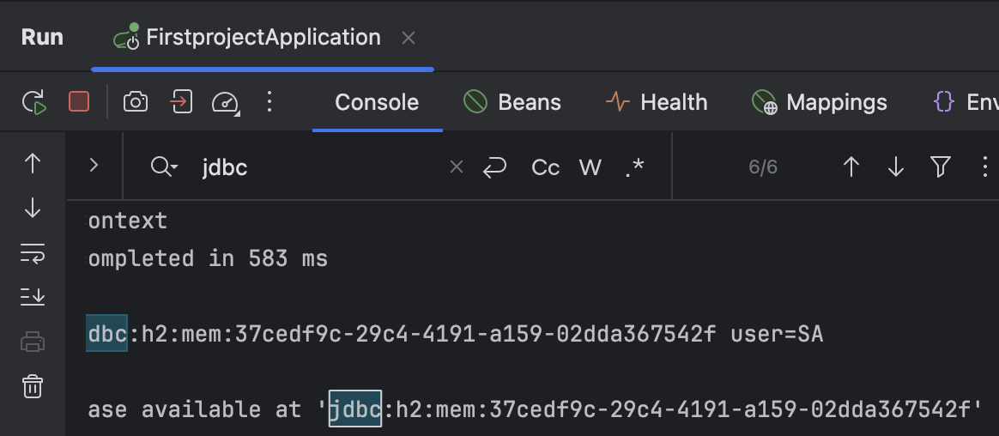
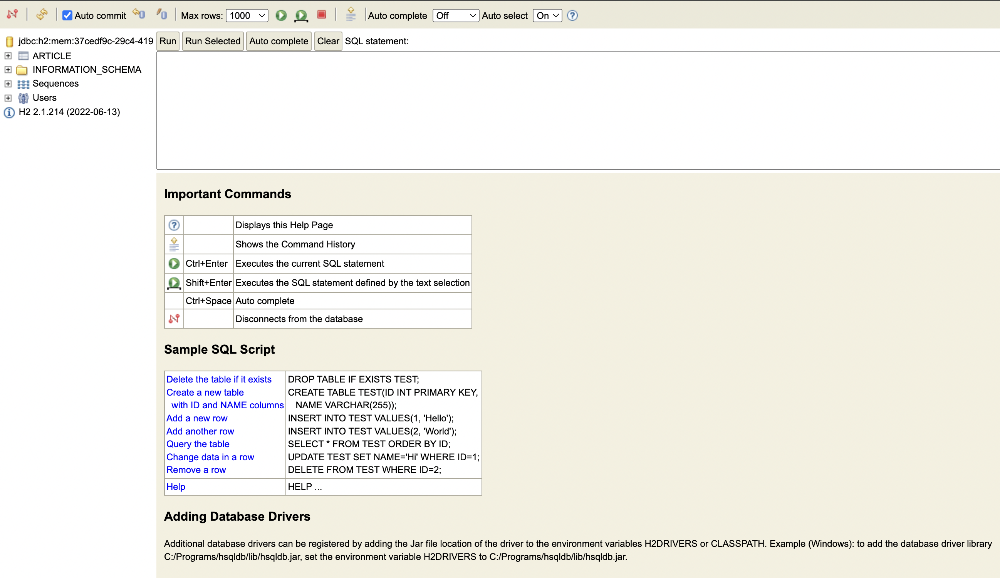
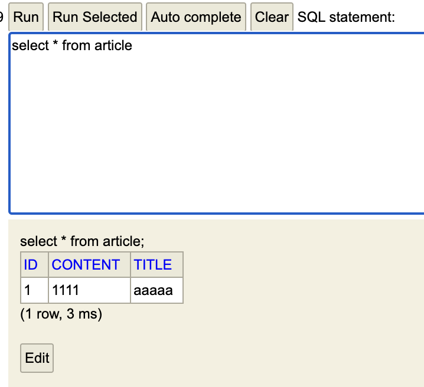
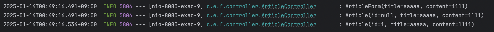

# 스프링 부트3 자바 백엔드 개발 입문 - 4일차

## 오늘의 학습 목차

- 3.4 DB 데이터 조회하기
- 4.1 롬복이란
- 4.2 롬복을 활용해 리팩터링하기

## 3.4 DB 데이터 조회하기

DB에 저장된 데이터는 `테이블`이라는 틀에 맞춰 관리된다. 테이블은 행(row)과 열(column)로 이루어져 있는데, 앞의 예시를 들자면 Article이라는 테이블은 id, title, content라는 3개의 열로 구성돼 있다.

이제 테이블에 데이터가 추가된다는 말은, 하나의 행씩 생성된다는 얘기이다. 보통 CRUD 조작은 SQL이라는 언어로 이뤄진다.

대표적인 SQL 문법은 다음과 같다.

- SELECT: 조회
- INSERT: 생성
- UPDATE: 수정
- DELETE: 삭제

### H2 DB 접속하기

먼저, src > main > resources > application.properties 파일에서 `spring.h2.console.enabled=true`라는 코드를 추가한다.

어플리케이션 설정을 새롭게 변경했기 때문에 서버를 재시작해서 localhost:8080/h2-console로 들어간다.

접속해보면, 연결(connect)하기 이전에 JDBC URL 입력을 필요로 하는 폼이 나타난다. 이 값은 서버를 실행할 때마다 바뀌므로 찾아서 입력해줘야 한다.

찾는 방법은 👉 인텔리제이의 Run탭에서 Ctrl or Command + F를 한 후에, jdbc:h2:mem: 으로 시작하는 문자열을 찾는 것이다.



이제 이 문자열을 입력하고 Connect 버튼을 누르면 다음과 같은 화면으로 넘어간다. H2 DB 접속에 성공한 것이다!



### 데이터 조회하기

'localhost:8080/articles/new' URL에 마련해 둔 폼에 데이터를 입력하면 이제 h2-console에서 확인할 수 있어야 한다. 제목에는 aaaaa, 내용은 1111을 입력하고 제출 버튼을 눌러보자.

이제 DB에 새롭게 생성되었을 데이터, 혹은 행(row), 또 다른 말로는 레코드를 확인하기 위해 콘솔 창에서 `SELECT * FROM ARTICLE`을 입력하고 Run 버튼을 누르면 다음과 같이 테이블 내 모든 레코드를 조회할 수 있다.



---

## 4.1 롬복이란

*롬복(lombok)*이란 코드를 간소화하는 라이브러리다. getter, setter, constructor(생성자), toString(오버라이딩 메서드)과 같이 자주 쓰는 메서드를 사용하기 마련인데, 매번 작성하는 것은 번거로운 일이다.

롬복을 사용하면 필수 코드를 간편하게 작성할 수 있고, 로깅 기능을 통해 `println()`문을 개선할 수 있다.

> 로깅(logging)이란 프로그램의 수행 과정을 기록으로 남기는 것을 말한다.

## 4.2 롬복을 활용해 리팩터링(코드의 기능의 변함 없이 구조 또는 성능 변경)하기

롬복도 라이브러리이므로, 처음에 추가했던 h2 database나 mustache처럼 build.gradle 파일에 추가로 명시해줘야 한다.

dependencies에 뒤따른 중괄호 안에 아래 두 줄을 추가하고, 편집기에 나타난 코끼리 모양의 새로 고침 버튼을 누르면 설치된다.

```text
compileOnly 'org.projectlombok:lombok'
annotationProcessor 'org.projectlombok:lombok'
```

이제 DTO인 ArticleForm에 작성된 생성자와 toString 메서드를 삭제하고 `@AllArgsConstructor`와 `@ToString` 어노테이션을 추가하는 것만으로도 같은 효과를 거둘 수 있다.

```java
package com.example.firstproject.dto;

import com.example.firstproject.entity.Article;

public class ArticleForm {
    private String title;
    private String content;

    public ArticleForm(String title, String content) {
        this.title = title;
        this.content = content;
    }

    @Override
    public String toString() {
        return "ArticleForm{" +
                "title='" + title + '\'' +
                ", content='" + content + '\'' +
                '}';
    }

    public Article toEntity() {
        return new Article(null, title, content);
    }
}
```

위에 코드는 롬복을 사용하여 아래 코드로 변환할 수 있다! 개인적으로는, 코드가 매우 짧아지는 것도 있지만 필드와 직접 생성한 메서드에 집중할 수 있다는 장점이 있다고 생각한다.

```java
package com.example.firstproject.dto;

import com.example.firstproject.entity.Article;
import lombok.AllArgsConstructor;
import lombok.ToString;

@AllArgsConstructor
@ToString
public class ArticleForm {
    private String title;
    private String content;

    public Article toEntity() {
        return new Article(null, title, content);
    }
}
```

> DTO 뿐만 아니라 엔티티에도 롬복을 적용할 수도 있다!

### 4.2.4 컨트롤러에 로그 남기기

```java
@Controller
public class ArticleController {
    // (...생략)

    @PostMapping("/articles/create")
    public String createArticle(ArticleForm form) {
        System.out.println(form.toString());

        // 1. DTO를 엔티티로 변환
        Article article = form.toEntity();
        System.out.println(article.toString());
        // 2. 레포지토리로 엔티티를 DB에 저장
        Article saved = articleRepository.save(article);
        System.out.println(saved.toString());
        return "";
    }
}
```

> [!WARNING]
> form 데이터, 엔티티, 저장한 데이터를 확인하기 위해 `println()`문을 사용하고 있지만, 실제 기록에도 남지 않고 서버의 성능에도 악영향을 미치기 때문에 실제 서버에서는 절대 사용해서는 안된다!

이 때, 대책으로 로깅 기능(서버에서 일어나는 모든 일을 기록하는 기능)을 활용할 수 있다. 나중에라도 그동안 기록된 로그를 확인해볼 수 있다는 장점도 있다.

다음과 같이 Controller 클래스를 변경하자. (with @Slf4j)

```java
@Slf4j
@Controller
public class ArticleController {
    // (...생략)

    @PostMapping("/articles/create")
    public String createArticle(ArticleForm form) {
        log.info(form.toString());
        // System.out.println(form.toString());

        // 1. DTO를 엔티티로 변환
        Article article = form.toEntity();
        log.info(article.toString());
        // System.out.println(article.toString());

        // 2. 레포지토리로 엔티티를 DB에 저장
        Article saved = articleRepository.save(article);
        log.info(saved.toString());
        // System.out.println(saved.toString());
        return "";
    }
}
```

이제 서버를 다시 재가동하고 새로운 데이터를 삽입하면, 어떤 데이터가 언제 저장되었는지 알 수 있는 로그가 남는다.


