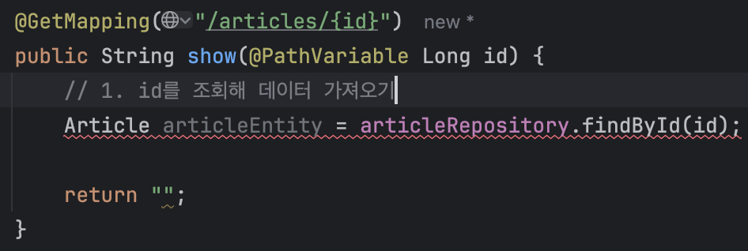
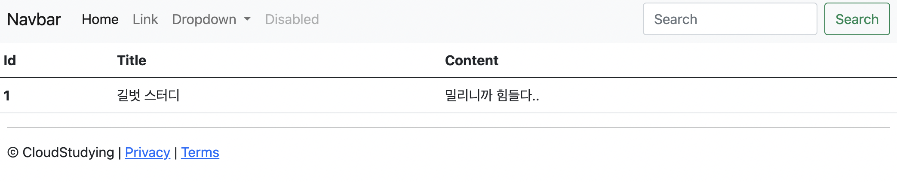
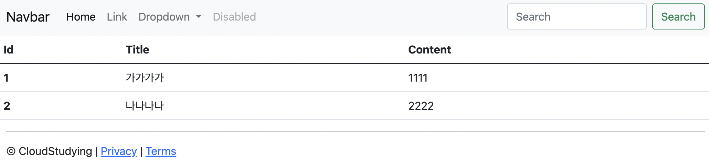

# 스프링 부트3 자바 백엔드 개발 입문 - 5일차

## 오늘의 학습 목차

- 5.1 데이터 조회 과정
- 5.2 단일 데이터 조회하기
- 5.3 데이터 목록 조회하기

## 5.1 데이터 조회 과정

1. 사용자가 데이터를 조회해 달라고 웹 페이지(브라우저)에서 URL 요청을 보낸다.
2. 서버의 컨트롤러가 요청을 받아 해당 URL에서 찾으려는 데이터 정보를 레포지토리에 전달한다.
3. 레포지토리는 정보(SQL의 Where 절에 들어갈 조건 등)를 가지고 DB의 데이터를 조회한다.
4. DB는 해당 데이터를 찾아서 이를 엔티티(`@Entity`)로 반환한다.
5. 반환된 엔티티는 모델을 통해 뷰 템플릿으로 전달된다.
6. 최종적으로 결과 뷰 페이지가 사용자(클라이언트)에게 응답되어 화면에 출력된다.

## 5.2 단일 데이터 조회하기

article 테이블의 id 필드를 사용하여 데이터를 조회해보기 전에, 서버를 구동하고 localhost:8080/articles/new의 폼을 사용해서 데이터를 넣어보자.

### 5.2.1 URL 요청받기

게시글 1번을 조회하기 위해 **localhost:8080/articles/1** 이라는 URL을 사용해보자.

하지만, 이대로 주소창에 위 URL로 접속하면 아무것도 찾을 수 없다는 에러(404 Not Found)가 나온다. 🧐 왜냐하면, 이를 받아 줄 컨트롤러가 없기 때문이다.

@PathVariable이라는 어노테이션을 사용하면 URL에 있는 매개변수를 가져올 수 있다는 점을 참고하여 작성해보자.

```java
@Slf4j
@Controller
public class ArticleController {
    // (...생략)

    @GetMapping("/aritcles/{id}")
    public String show(@PathVariable Long id) {
        log.info("id = " + id); // 로그가 잘 남는다.
        return "";
    }
}
```

여기까지가 컨트롤러가 URL 요청을 받는 과정이다.

### 5.2.2 데이터 조회해 출력하기

이제 DB에서 데이터를 가져 올 레포지토리가 필요하다. findById라는 이미 JPA의 CrudRepository가 제공하는 메서드를 사용하면 다음과 같은 문제가 생긴다...!



> [!NOTE]
> findById 메서드가 반환하는 타입이 `Article`이 아니라 `Optional<Article>` 타입이기 때문이다! 다른 방법을 사용할 수도 있는데 .findById(id) 뒤에 `.orElse(null)`을 붙여서 해당 id에 해당하는 레코드가 없을 때 null을 할당할 수도 있다.

그럼 이제는 DB에서 엔티티를 받아온 셈이다.

그 다음으로는 데이터를 모델에 등록해서 뷰 페이지에서 사용할 수 있게 하고, 뷰 페이지를 반환하기만 하면 된다.

```java
import org.springframework.ui.Model;

@GetMapping("/articles/{id}")
public String show(@PathVariable Long id, Model model) {
    // 1. id를 조회해 데이터 가져오기
    Article articleEntity = articleRepository.findById(id).orElse(null);

    // 2. 모델에 데이터 등록하기
    model.addAttribute("article", articleEntity);

    // 3. 뷰 페이지 반환하기
    return "articles/show";
}
```

👉 책을 따라 뷰 페이지에 해당하는 show.mustache를 만들고, 엔티티 클래스인 Article 클래스에 기본 생성자를 위한 @NoArgsConstructor까지 잘 추가하고 나면 실제 DB 상의 데이터가 잘 나오는 것을 확인할 수 있다.



## 5.3 데이터 목록 조회하기

단일 데이터를 조회할 때는 레포지토리가 엔티티를 반환했다면, 데이터 목록을 조회할 때는 엔티티의 묶음인 리스트를 반환한다.

```java
@GetMapping("/articles")
public String index(Model model) {
    // 1. 모든 데이터 가져오기
    // ArrayList에서 List로 업캐스팅
    List<Article> articleEntityList = articleRepository.findAll();

    // 2. 모델에 데이터 등록하기
    model.addAttribute("articleList", articleEntityList);

    // 3. 뷰 페이지 설정하기
    return "articles/index";
}
```

단일 엔티티를 DB로부터 가져오는 코드와 다른 부분은 다음과 같다.

1. 일단 URL에 id라는 매개변수가 없는데, 그 이유는 article에 있는 모든 데이터를 가져오면 되기 때문이다.
2. CrudRepository가 제공하는 findAll 메서드의 반환 타입은 Iterable이기 때문에, 해당 타입에 익숙하지 않으면 오버라이딩을 통해 반환 타입을 바꿔주는 것이 편하다.

> [!NOTE]
> ArrayList는 List를, List는 Collection을, Collection은 Iterable을 상속한다.

```java
// ArticleRepository.java
public interface ArticleRepository extends CrudRepository<Article, Long> {
    @Override
    ArrayList<Article> findAll();
    // 원래는 Iterable<Article> findAll();로 되어 있으나 이를 다운 캐스팅(암시적으로 가능) 한 것이다.
}
```

이제 여러 데이터를 등록하고, index.mustache 뷰 페이지에 모델이 잘 데이터를 전달했는지 확인하자.


