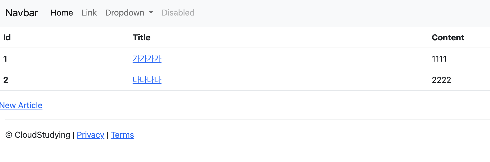

# 스프링 부트3 자바 백엔드 개발 입문 - 6일차

## 오늘의 학습 목차

- 6.1 링크와 리다이렉트란
- 6.2 링크와 리다이렉트를 이용해 페이지 연결하기

## 6.1 링크와 리다이렉트란

웹 게시판 서비스를 예로 들자면, 1. 목록 페이지에서 특정 글을 눌러 상세 페이지로 가기도 하고 2. 글쓰기 버튼을 눌러 입력 페이지로 가기도 한다. 이러한 페이지 이동을 구현하기 위해서 링크와 리다이렉트라는 기능을 이해해야 한다.

**링크** 란 미리 정해 놓은 요청을 간편히 전송하는 기능으로, 페이지 이동을 위해 사용한다. HTML의 `<a> 태그`나 `<form> 태그`로 작성하고, 클라이언트가 링크를 통해 어느 페이지로 이동하겠다고 하면 서버가 그 페이지를 응답한다.

📌 그런데, 서버에서 결과 페이지를 응답하지 않고 재요청하라고 회신하기도 한다. 상담사 a 한테 연결했으나 사실 업무 담당은 상담사 b일 때, b에게 전화하라고 요청받는 경우와 비슷하다. 이것이 바로 **리다이렉트** 다.

보통 리다이렉트 개념은 다음 경우에 많이 사용한다.

- 게시물 업로드 후에 목록 페이지나 상세 페이지로 갈 때
- 게시물 업데이트 후에 목록 페이지나 상세 페이지로 갈 때
- 게시물 삭제 후에 목록 페이지나 상세 페이지로 갈 때

결국 클라이언트가 처음에 보낸 요청(업로드 or 업데이트 or 삭제)은 마치고 나서, 리다이렉트의 대상이 되는 주소로 다시 요청하도록 클라이언트에게 회신하는 것이다.

## 6.2 링크와 리다이렉트를 이용해 페이지 연결하기

지금까지 만든 웹 게시판 서비스에는 부자연스러운 부분이 있다.

- 서비스 첫 접속 지점이면서 작성한 글을 볼 수 있는 index.mustache 목록 페이지에 입력 페이지로의 이동 가능한 경로가 없다.
- 입력 페이지에서 입력 시도 중에 취소하고 다시 목록 페이지로 갈 수 없다.
- 입력 페이지에서 게시물 만드는 제출 버튼 클릭 이후에 에러 페이지가 뜬다.
- 상세 페이지에서 다시 목록 페이지로 가는 경로가 없다.
- 목록 페이지에서 상세 페이지로 가는 경로가 없다.

차례대로 해결해보자!

### 목록 페이지에서 입력 페이지로 가기

index.mustache에 `<a> 태그`, 그리고 href 속성에 요청을 보낼 링크 주소인 "/articles/new"를 넣으면 된다.

```html
<!-- new.mustache -->
</table>

<a href="/articles/new">New Article</a>

{{>layouts/footer}}
```

### 입력 페이지에서 목록 페이지로 돌아가기

작성하던 도중에 돌아가기 위한 `<a> 태그`를 작성할 수 있다.

```html
<!-- new.mustache -->

    <button type="submit" class="btn btn-primary">Submit</button>
    <a href="/articles">Back</a>
</form>
```

### 입력 페이지에서 상세 페이지로 이동하기

> 게시물 작성을 위한 입력을 마치고 제출(Submit) 버튼을 눌러 POST 요청을 서버에 건네면, 컨트롤러가 그 요청을 처리하도록 구현했었다.

그 컨트롤러는 `ArticleController`였는데, 마지막에 반환하는 String 타입의 데이터가 빈 문자열로 되어 있어서 에러 페이지가 뜨고 있다...!

이 때, 클라이언트로 하여금 상세 페이지 주소로 재요청하라고 지시하는 리다이렉트 기능을 사용해볼 수 있다.

```java
@PostMapping("/articles/create")
public String createArticle(ArticleForm form) {
    log.info(form.toString());

    // 1. DTO를 엔티티로 변환
    Article article = form.toEntity();
    log.info(article.toString());

    // 2. 레포지토리로 엔티티를 DB에 저장
    Article saved = articleRepository.save(article);
    log.info(saved.toString());

    // 3. 상세 페이지로 리다이렉트
    return "redirect:/articles/" + saved.getId();
}
```

엔티티 클래스인 Article에 롬복이 제공하는 Getter 어노테이션을 명시해서 .getId()라는 메서드를 사용할 수 있게 변환하는 것이 중요하다.

### 상세 페이지에서 목록 페이지로 이동하기

상세 페이지인 show.mustache 파일에 목록 페이지로 이동하는 링크를 추가하면 된다.

```html
<!-- show.mustache -->

</table>

<a href="/articles">Go to Article List</a>

{{>layouts/footer}}
```

### 목록 페이지에서 상세 페이지 이동하기

목록에 있는 글 하나를 클릭했을 때 그 글에 대한 상세를 확인할 수 있는 상세 페이지로 이동해야 한다.

모델을 통해 뷰 페이지로 넘어 온 `List<Article>` 타입의 ArticleList의 요소들이 반복되어 나타나는데 Article 인스턴스의 id 필드를 활용하면 상세 페이지로 각각 이동할 수 있다.

```html
<!-- index.mustache -->
<tbody>
  {{#articleList}}
  <tr>
    <th>{{id}}</th>
    <td><a href="/articles/{{id}}">{{title}}</a></td>
    <td>{{content}}</td>
  </tr>
  {{/articleList}}
</tbody>
```


