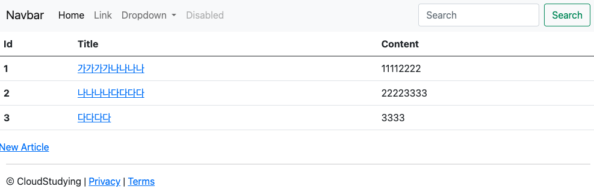

# 스프링 부트3 자바 백엔드 개발 입문 - 7일차

## 오늘의 학습 목차

- 7.1 데이터 수정 과정
- 7.2 <수정 페이지> 만들기
- 7.3 수정 데이터를 DB에 갱신하기

## 7.1 데이터 수정 과정

게시판에 이미 작성하여 업로드한 글을 수정하려면 다음과 같은 단계를 거쳐야 한다.

1. <수정 페이지> 만들고 기존 데이터 불러오기
2. 데이터를 수정해 DB에 반영한 후 결과를 볼 수 있게 <상세 페이지>로 리다이렉트하기

1번과 2번 과정을 더 자세하게 나눠보자.

- <수정 페이지> 만들고 기존 데이터 불러오기

  - <상세 페이지>에서 [Edit] 버튼 누르기
  - 요청 받은 컨트롤러는 해당 글의 id로 DB에서 데이터를 찾아서 가져오기
  - 컨트롤러는 가져온 데이터를 뷰에서 사용할 수 있게 모델에 등록하기
  - 모델에 등록된 데이터를 <수정 페이지>에서 보여주기

- 데이터를 수정해 DB에 반영한 후 결과를 볼 수 있게 <상세 페이지>로 리다이렉트하기
  - 폼 데이터(수정 요청 데이터)를 DTO에 담아 컨트롤러에서 받기
  - DTO를 엔티티로 변환하기
  - DB에서 기존 데이터를 수정 데이터로 갱신하기
  - 수정 데이터를 <상세 페이지>로 리다이렉트하기

## 7.2 <수정 페이지> 만들기

1. 먼저 <상세 페이지>에서 누를 수 있는 [Edit] 버튼을 만들자.

```html
<a href="/articles/{{article.id}}/edit" class="btn btn-primary">Edit</a>
<a href="/articles">Go to Article List</a>
{{>layouts/footer}}
```

> [!TIPS]
> 뷰 페이지에 넘긴 모델의 사용 범위를 지정하지 않고도 일회성으로도 사용할 수 있다. 이 때는, 점(.)을 이용하면 된다.

이제 [Edit] 버튼을 누르면 에러 페이지가 뜬다. 왜냐하면, 요청을 받을 컨트롤러가 작성되어 있지 않기 때문이다.

2. 요청을 받을 컨트롤러를 만들고, 데이터를 가져오자.

```java
// ArticleController.java
@GetMapping("/articles/{id}/edit")
public String edit(@PathVariable Long id, Model model) {
    // id로 수정할 데이터 가져오기
    Article articleEntity = articleRepository.findById(id).orElse(null);

    // 모델에 데이터 등록하기
    model.addAttribute("article", articleEntity);

    // 뷰 페이지 설정하기
    return "articles/edit";
}
```

글 하나에 대한 수정이 이뤄지는 페이지를 서버로부터 받아오기 위해 `/articles/{id}/edit`이라는 url을 컨트롤러에 매핑한다.

그리고 id를 매개하여 DB로부터 데이터를 가져와서 모델에 등록하고, 모델을 특정 뷰 페이지에 전달할 수 있다.

3. 이제 전달한 모델을 받아줄 수정 폼(뷰 페이지)을 만들자.

입력 페이지인 new.mustache를 약간 변형하여 edit.mustache를 만들 수 있다.

```html
{{>layouts/header}}

<form class="container" action="" method="post">
  <div class="mb-3">
    <label class="form-label">제목</label>
    <input type="text" class="form-control" name="title" />
  </div>
  <div class="mb-3">
    <label class="form-label">내용</label>
    <textarea class="form-control" rows="3" name="content"></textarea>
  </div>
  <button type="submit" class="btn btn-primary">Submit</button>
  <a href="/articles/{{article.id}}">Back</a>
</form>

{{>layouts/footer}}
```

서버를 구동해서 수정 페이지에 들어가보면 아직 고쳐야 할 글에 대한 정보가 나타나지 않는다.

4. 수정 페이지에 내용이 보이게 하자.

범위를 지정하지 않고 일회성으로 Article 타입의 데이터를 이용하려면 다음과 같이 작성하면 된다.

```html
{{>layouts/header}}

<form class="container" action="" method="post">
  <div class="mb-3">
    <label class="form-label">제목</label>
    <input
      type="text"
      class="form-control"
      name="title"
      value="{{article.title}}"
    />
  </div>
  <div class="mb-3">
    <label class="form-label">내용</label>
    <textarea class="form-control" rows="3" name="content">
{{article.content}}</textarea
    >
  </div>
  <button type="submit" class="btn btn-primary">Submit</button>
  <a href="/articles/{{article.id}}">Back</a>
</form>

{{>layouts/footer}}
```

> [!NOTE] > `<input> 태그`로 생성한 입력 요소의 초깃값은 value 속성에 정의하지만, `<textarea> 태그`로 생성한 여러 줄의 입력 요소는 콘텐츠 영역에 초깃값을 지정한다.

## 7.3 수정 데이터를 DB에 갱신하기

매번 서버를 시작할 떄마다 데이터를 입력하는 반복작업을 줄이기 위해 다음의 과정을 거치면 localhost:8080/articles 접속 시에 더미 데이터를 볼 수 있다.

1. src > main > resources 아래 data.sql 작성

```sql
INSERT INTO article(id, title, content) VALUES(1, '가가가가', '1111');
INSERT INTO article(id, title, content) VALUES(2, '나나나나', '2222');
INSERT INTO article(id, title, content) VALUES(3, '다다다다', '3333');
```

2. 스프링 부트 2.5 버전부터 data.sql을 사용한 데이터 초기화를 권장하지 않기 때문에, application.properties 파일에 `spring.jpa.defer-datasource-initialization=true` 옵션을 추가

> [!IMPORTANT]
> 클라이언트와 서버 간에 데이터를 전송할 때는 다양한 통신 규약, 즉 프로토콜을 따른다. **프로토콜(protocol)** 은 기기 간에 각종 신호 처리 방법, 오류 처리, 암호, 인증 방식 등을 규정하고 있어서 이를 따라야지만 오류나 지연 없이 원활하게 통신할 수 있다. HTTP는 그중에서도 웹 서비스에 사용하는 프로토콜이다.

HTTP 메서드로 데이터 수정을 요청하고 실제 DB에 반영해보자.

### 7.3.3 <수정 페이지> 변경하기

먼저, 수정 폼에서의 action 속성(폼 데이터를 어디에 보낼지 결정하는 속성)과 method 속성(어떻게 보낼지 결정하는 속성)을 결정해야 한다.

action에는 `/articles/update`, method에는 `post`를 주자.

> [!WARNING]
> 수정 요청인데 왜 메서드에 patch를 주지 않을까? - `<form> 태그`는 옛날에 만들어진 규격이라 해당 http 메서드를 지원하지 않는다. get과 post만 지원하기 때문에 post를 이용한다.

그리고, 어떤 id를 가진 글을 수정하는지 서버에게 알려줘야 하기 때문에 `<input name="id" type="hidden" value="{{id}}" >`를 폼에 넣어 보내줘야 한다.

### 7.3.4 수정 데이터 받아 오기

수정 페이지에서 제출 버튼을 누르면 에러 페이지가 나오는데, 이러한 요청을 받아줄 만한 컨트롤러가 필요하다.

```java
@PostMapping("/articles/update")
public String update(ArticleForm form) {
    log.info(form.toString());

    return "";
}
```

수정 폼에서 날라온 데이터를 DTO로 받고 있다.

이전에 ArticleForm 클래스에 선언된 필드와 메서드에는 id가 없었는데, 폼에서는 id도 함께 보내주고 있으므로 필드와 `toEntity()` 메서드에 추가하는 과정이 필요하다.

### 7.3.5 DB에 저장하고 결과 페이지로 리다이렉트하기

```java
@PostMapping("/articles/update")
public String update(ArticleForm form) {
    log.info(form.toString());

    // 1. DTO를 엔티티로 변환하기
    Article articleEntity = form.toEntity();
    log.info(articleEntity.toString());

    // 2. 엔티티를 DB에 저장하기
    // 2-1. DB에서 기존 데이터 가져오기
    Article target = articleRepository.findById(articleEntity.getId()).orElse(null);

    // 2-2. 기존 데이터 값을 갱신하기
    // 클릭을 통해 수정 요청을 하므로 target이 null이 될 일은 없지만, 비정상적인 요청을 막기 위해 조건문을 사용
    if (target != null) {
        articleRepository.save(articleEntity);
    }

    // 3. 상세 페이지로 리다이렉트
    return "redirect:/articles/" + articleEntity.getId();
}
```

먼저 DB에 저장하기 위해 DTO를 엔티티로 변환하고, 기존 데이터를 바꾸기 위해 DB에서 가져오는 작업을 `findById()` 메서드를 통해 수행하고 있다.

기존 데이터를 가져오고 나면 기존 데이터의 값을 갱신하기 위해서 save 메서드를 수행한다.

> [!IMPORTANT]
> CrudRepository에서 제공하는 save 메서드는 데이터를 초기에 저장하는 데만 사용한다고 생각했으나 그렇지 않다. 기본적으로 스프링에서는 ID 필드가 null이 아닐 경우, 해당 엔티티를 기존 객체로 판단한다. 그래서 PK가 결정되어 있는 엔티티를 save하려고 하면 JPA는 내부적으로 이미 존재하는 객체로 판단하여 update query를 수행하는 로직이 내부에 숨어있다...!

이제 수정이 잘 이뤄진다!


