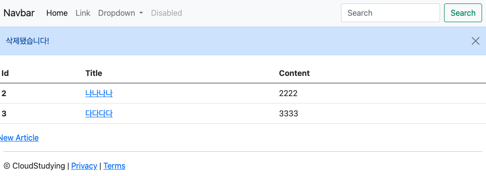
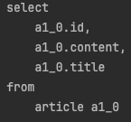
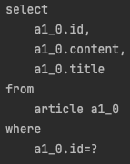
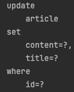
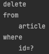
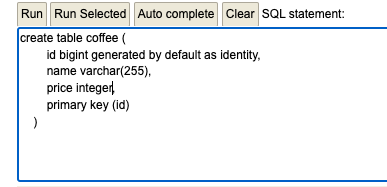

# 스프링 부트3 자바 백엔드 개발 입문 - 8일차, 9일차

## 오늘의 학습 목차

- 8.1 데이터 삭제 과정
- 8.2 데이터 삭제하기
- 9.1 JPA 로깅 설정하기
- 9.2 SQL 쿼리 로그 확인하기
- 9.3 기본 SQL 쿼리 작성하기

## 8.1 데이터 삭제 과정

1. 클라이언트가 HTTP 메서드로 특정 게시글의 삭제를 요청한다. 아마 고유한 id를 통해 삭제를 요청할 것이다.
2. 삭제 요청을 받은 컨트롤러는 레포지토리를 통해 DB에 저장된 데이터를 찾아 삭제한다. 이 작업은 데이터가 있는 경우에만 수행된다.
3. 삭제가 완료되면 클라이언트를 결과 페이지로 리다이렉트한다.

> [!TIP]
> 결과 페이지로 리다이렉트할 때 클라이언트에 삭제 완료 메시지도 띄울 수 있는데, `RedirectAttributes` 클래스의 `addFlashAttribute()`라는 메서드를 사용할 수 있다. 해당 메서드는 리다이렉트된 페이지에서 사용할 일회성 데이터를 등록할 수 있다. 포워딩이 아닌 리다이렉트다보니 모델 객체에 데이터를 등록할 수 없어서 사용하는 것 같다...!

## 8.2 데이터 삭제하기

### 8.2.1 Delete 버튼 추가하기

게시글의 상세 내용을 보여주는 show.mustache 파일에 다음 html 요소를 붙여 넣는다.

```html
<a href="/articles/{{article.id}}/delete" class="btn btn-danger">Delete</a>
```

### 8.2.2 Delete 요청을 받아 데이터 삭제하기

> HTML에서는 POST와 GET을 제외한 다른 메서드를 제공하지 않기 때문에, 여기서는 DELETE가 아닌 GET 방식으로 삭제 요청을 받아서 처리한다.

컨트롤러 메서드 delete를 작성하면 처음에 들어있던 더미 데이터를 지울 수 있다.

```java
@GetMapping("/articles/{id}/delete")
public String delete(@PathVariable Long id) {
    log.info("삭제 요청이 들어왔습니다!!");

    // 1. 삭제할 대상 가져오기
    Article target = articleRepository.findById(id).orElse(null);
    log.info(target.toString());

    // 2. 대상 엔티티 삭제하기
    if (target != null) {
        articleRepository.delete(target);
    }

    // 3. 결과 페이지로 리다이렉트하기
    return "redirect:/articles";
}
```

> [!IMPORTANT]
> 수정 요청 때와 마찬가지로 삭제하기 전에 id라는 키를 통해 삭제할 대상을 먼저 조회하고 null인지를 판단하는 과정이 있다. 이는 비정상적인 수정 요청을 방지하기 위함이다.

### 8.2.3 삭제 완료 메시지 남기기

RedirectAttributes 클래스의 addFlashAttribute 메서드를 사용해서 리다이렉트 후의 페이지에서 사용 가능한 일회성 데이터를 지정할 수 있다.

```java
@GetMapping("/articles/{id}/delete")
    public String delete(@PathVariable Long id, RedirectAttributes rttr) {
        log.info("삭제 요청이 들어왔습니다!!");

        // 1. 삭제할 대상 가져오기
        Article target = articleRepository.findById(id).orElse(null);
        log.info(target.toString());

        // 2. 대상 엔티티 삭제하기
        if (target != null) {
            articleRepository.delete(target);
            rttr.addFlashAttribute("msg", "삭제됐습니다!");
        }

        // 3. 결과 페이지로 리다이렉트하기
        return "redirect:/articles";
    }
```

이제 `msg`라고 하는 데이터를 사용하기 위해 index.mustache 파일에서 mustache 문법으로 사용 범위를 지정하고 내부에서 쓸 수 있다.

```html
</nav>

{{#msg}}
    <div class="alert alert-primary alert-dismissible">
        {{msg}}
        <button type="button" class="btn-close" data-bs-dismiss="alert" aria-label="Close"></button>
    </div>
{{/msg}}
```

삭제되었다는 메시지를 받을 수 있다!



---

## 9.1 JPA 로깅 설정하기

그 전에, 우리가 왜 JPA 로깅을 설정해야 하는지 알아보자.

서버에서 데이터의 생성(C), 조회(R), 수정(U), 삭제(D) 등을 요청하면 JPA의 레포지토리가 DB에 해당 요청을 전달한다. 요청 받은 DB는 SQL로 쿼리를 작성해서 테이블의 데이터를 관리한다.

우리가 이번 9장에서 해볼 것은 서버의 CRUD 수행에 따른 DB의 SQL 쿼리의 분석이다.

그래서 **로깅(logging, 시스템이 작동할 때 당시의 상태와 작동 정보를 기록하는 것)** 을 하기 위해 다음과 같은 과정을 거쳐야 한다.

1. application.properties 파일에서 로깅 레벨을 디버그(DEBUG)로 설정한다. 그 때 `logging.level.org.hibernate.SQL=DEBUG`라 쓰면 된다. 우리는 JPA가 동작할 때 수행되는 SQL 쿼리를 보기 위해 DEBUG로 한다.

> [!TIP]
> 로깅 레벨에는 7단계가 있다. 레벨 1부터 7까지 TRACE, DEBUG, INFO, WARN, ERROR, FATAL, OFF 순이고 출력 레벨을 설정하면 해당 레벨 이상의 로그가 출력된다.

2. 서버를 실행하면 이전에 보지 못한 org.hibernate.SQL 문구를 콘솔에서 확인할 수 있다.

3. 보기 좋게 정렬하기 위해 application.properties에 `spring.jpa.properties.hibernate.format_sql=true`를 추가적으로 명시한다.

4. 서버를 재실행하면 SQL 쿼리를 줄바꿈하여 출력하는 것을 볼 수 있다.

5. JPA 쿼리에서 DB로 넘어가는 매개변수 값을 확인하는 코드를 application.properties 파일에 추가한다. 종종 로그에 찍힌 SQL 쿼리를 보다 보면 물음표(?)가 있는데 그 값을 직접 확인할 수 있게 하는 설정이다. `logging.level.org.hibernate.type.descriptor.sql.BasicBinder=TRACE`를 쓰면 된다.

6. 서버를 재실행할 때마다 H2 DB에 접속해서 JDBC URL를 새롭게 적어줬는데 URL을 고정할 수 있다. 유니크 URL 설정을 false로 하고, 어떤 값을 고정할 건지 적어 준다.

```shell
# DB URL 설정
# 유니크 URL 생성하지 않기
spring.datasource.generate-unique-name=false
# 고정 URL 설정하기
spring.datasource.url=jdbc:h2:mem:testdb
```

7. 이제 고정한 JDBC URL 값으로 H2 DB 콘솔에 적고, 접속한다.

## 9.2 SQL 쿼리 로그 확인하기

이제는 생성, 조회, 수정, 삭제할 때 내부에서 어떤 SQL 쿼리가 동작하는지 로그를 통해 확인할 수 있다.

### 9.2.1 데이터 생성 시: INSERT 문

❌ localhost:8080/articles/new에서 새롭게 제목과 내용을 가진 게시글을 작성하고 Submit 버튼을 누르면 에러가 뜬다.

콘솔에서 확인할 수 있는 에러는 `Unique index or primary key violation`인데 고유 인덱스 또는 기본키 위반이라는 뜻이다.

에러가 발생하는 이유는 다음과 같다. 처음에 더미 데이터를 생성하느라 1, 2, 3이라는 id를 이미 사용했는데 새 게시글을 작성하면서 자동으로 1이라는 id를 사용하려다가 문제가 생긴 것이다.

정말 중요한 사실인데, 테이블에 저장된 각 데이터를 유일하게 구분할 수 있도록 지정한 속성이 **기본키(primary key)** 이다. 그러므로 기본키에 들어가는 값이 한 테이블에 여러 개가 되지 않도록 해야 한다.

```java
public class Article {
    @Id
    @GeneratedValue(strategy = GenerationType.IDENTITY) // DB가 id 자동 생성
    private Long id;

    @Column
    private String title;

    @Column
    private String content;
}
```

약간의 어노테이션 수정으로 id 자동 생성 전략이 추가되었고, 데이터를 생성할 때마다 DB에 알아서 id 값을 넣어준다.

이제, 더미 데이터를 넣기 위한 data.sql에서 id와 관련된 내용을 삭제하자.

```sql

INSERT INTO article(title, content) VALUES( '가가가가', '1111');
INSERT INTO article(title, content) VALUES( '나나나나', '2222');
INSERT INTO article(title, content) VALUES( '다다다다', '3333');
```

그러고 나서 다시 새로운 게시글을 입력하면 제대로 DB에 id가 4인 새 글이 생성된 것을 확인할 수 있다. 이 때 수행되는 쿼리를 살펴보자.

#### /articles 에 나오는 모든 게시글 조회의 경우



SELECT 문이 포함되어 있는 것을 볼 수 있다.

#### /articles/4 에 나오는 게시글 상제 조회의 경우



SELECT 문에 WHERE 절이 추가된 것을 볼 수 있다.

### 9.2.3 데이터 수정 시: UPDATE 문



UPDATE 쿼리가 수행되었다. ? 자리는 JPA에서 DB로 전달하는 매개 변수인데 로그에서 실제 해당하는 값을 찾아볼 수 있다.

### 9.2.4 데이터 삭제 시: DELETE 문



WHERE 절이 추가된 DELETE 쿼리를 수행한 것을 확인할 수 있다.

## 9.3 기본 SQL 쿼리 작성하기

### 9.3.1 coffee 테이블 만들기

CREATE TABLE 문을 H2 DB 콘솔에 입력하여 coffee 테이블을 만들어보자.



### 9.3.2 coffee 데이터 생성하기

> SQL 문의 마지막에는 세미콜론을 붙이는 걸 습관화하자!

```sql
INSERT INTO coffee(id, name, price) VALUES (1, '아메리카노', 4100);
INSERT INTO coffee(id, name, price) VALUES (2, '라떼', 4600), (3, '모카', 5100), (4, '오늘의 커피', 3800);
```

### 9.3.3 coffee 데이터 조회하기

테이블에 생성한 데이터를 조건을 걸어 조회해보자.

```sql
SELECT id, name, price FROM coffee WHERE id = 3;
SELECT id, name, price FROM coffee;
```

### 9.3.4 coffee 데이터 수정하기

```sql
UPDATE coffee SET price = 9900 WHERE id = 4;
```

### 9.3.5 coffee 데이터 삭제하기

```sql
DELETE FROM coffee WHERE id = 4;
```
