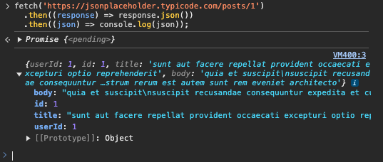
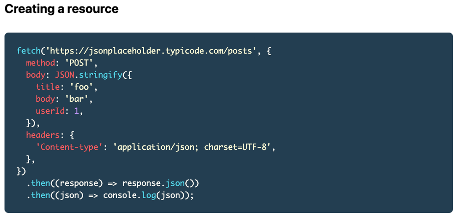
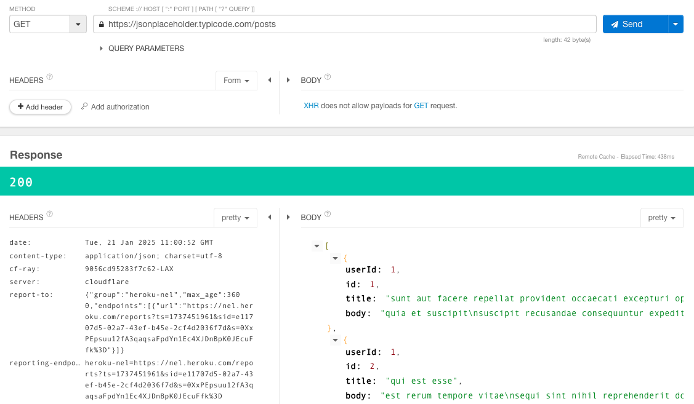
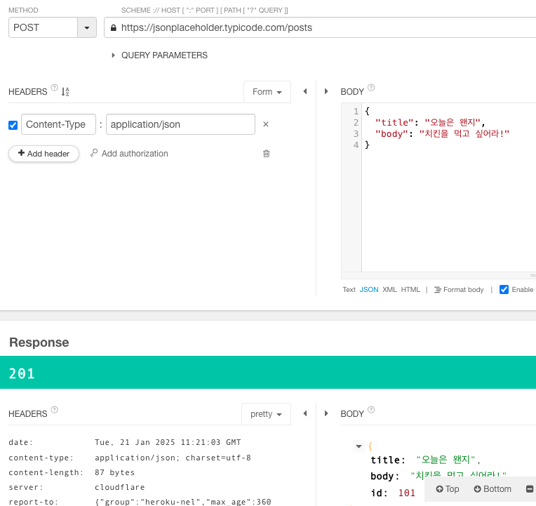

# 스프링 부트3 자바 백엔드 개발 입문 - 10일차

## 오늘의 학습 목차

- 10.1 REST API와 JSON의 등장 배경
- 10.2 REST API 동작 살펴보기

## 10.1 REST API와 JSON의 등장 배경

웹 서비스를 사용하는 클라이언트는 PC 화면으로 특정되지 않고, 스마트폰, 스마트워치, 태블릿, 센서 등 모든 통신이 가능한 전자기기는 모두 해당될 수 있다.

서버는 이러한 모든 클라이언트의 요청에 응답해야 하므로 규격이 서로 다른 뷰 페이지, 즉 화면을 응답하기보다 데이터를 응답하는 것이 좋다. 그래서, **REST API(Representational State Transfer API)** 라는 서버의 자원을 클라이언트에 구애받지 않고 사용할 수 있게 하는 설계 방식이 등장했다.

과거에는 응답 데이터로 XML을 많이 사용했으나, 최근에는 **JSON(JavaScript Object Notation)** 으로 통일되는 추세이다.

JSON의 예시를 하나 들자면,

```json
{
  "name": "망고",
  "breeds": "골든리트리버",
  "age": 2
}
```

> [!NOTE]
> API(Application Programming Interface)란 어플리케이션을 간편히 사용할 수 있게 미리 정해진 일종의 약속이다. 웹 프론트엔드 개발과 웹 백엔드 개발 사이에는 어떤 URL로 요청을 보내야 어떤 자원을 받을 수 있을지 API를 명세하는 일이 있다.

## 10.2 REST API 동작 살펴보기

### 10.2.1 {JSON} Placeholder 사이트 둘러보기

가짜 API를 사용해서 목(mock) 데이터를 받을 수 있고, 간단히 테스트를 진행할 수 있는 서비스를 제공한다.

[json_placeholder](https://jsonplaceholder.typicode.com/)

가이드 사이트로 넘어가면 ([json_placeholder_guide](https://jsonplaceholder.typicode.com/guide/)) 여러 예시가 나오는데, 그 중 Getting a resource라는 제목을 가진 예시를 보자.

책에서는 그렇게 하지 않지만, 브라우저 개발자 도구의 콘솔창에 fetch문을 작성하면 데이터를 얻을 수 있다.



데이터의 조회를 요청할 떄는 method의 속성 값으로 GET을 써야 하는데 fetch 문에는 그런 흔적이 없다. 그 이유는 GET은 method 속성의 기본값이라서 생략해도 되기 때문이다.



데이터 생성 요청의 경우는 method 속성에 POST라는 값이 매핑되어 있고, 요청의 body 부분에 JSON 데이터가 들어있는 것을 확인할 수 있다.

그 후에 Updating a resource, 그리고 Patching a resource라는 각각의 제목으로 두 예시가 있는데 게시글을 수정한다는 점에서 의미는 유사하지만 PUT과 PATCH라는 메서드 차이가 있다.

> [!IMPORTANT] > `PUT`은 기존 데이터를 전부 새 내용으로 변경한다. 만약 기존 데이터가 없다면 새로 생성한다. `PATCH`는 기존 데이터 중에서 일부만 새 내용으로 변경한다.

마지막으로 데이터 삭제 요청에는 DELETE 메서드를 사용한다.

### 10.2.2 Talend API Tester 설치하기

크롬 웹 스토어에서 **Talend API Tester** 확장을 설치해서 HTTP 요청을 보내고 돌아온 응답을 확인해보자.

`https://jsonplaceholder.typicode.com/posts`로 GET 요청을 보내서 모든 게시물을 불러와보자.



200이라는 상태 코드와 함께 요청이 잘 처리되었고 BODY 부분에서 JSON 데이터를 확인할 수 있다.

JSON Placeholder 서비스에서 제공하는 게시물의 개수는 100개인데 101번의 게시물을 조회하면 404라는 상태 코드를 얻을 수도 있다.

HTTP 상태 코드는 클라이언트가 보낸 요청이 성공했는지, 실패했는지 알려 주는 코드인데 5개 그룹으로 이뤄져 있다.

- 1XX(정보) : 요청이 수신되어 처리 중
- 2XX(성공) : 요청이 정상적으로 처리
- 3XX(리다이렉션 메시지) : 요청을 완료하려면 추가 행동이 필요
- 4XX(클라이언트 요청 오류) : 클라이언트 요청이 잘못되어서 서버가 요청을 수행할 수 없음
- 5XX(서버 응답 오류) : 서버 내부에 에러가 발생해서 클라이언트 요청에 대해 적절히 수행할 수 없음

요청과 응답은 HTTP 메시지에 실려서 전송된다. 요청할 때는 HTTP 요청 메시지에, 응답할 때는 HTTP 응답 메시지에 내용이 실린다.

Talend API Tester에서도 그 내용을 확인할 수 있고 시작 라인, 헤더, 빈 라인, 본문으로 이뤄져 있다.

- 시작 라인 : HTTP 요청 및 응답 내용(항상 한 줄로 끝남)
- 헤더 : HTTP 전송에 필요한 부가 정보(metadata)가 있음
- 빈 라인 : 헤더의 끝을 알리는 빈 줄로, 헤더가 모두 전송되었음을 알림
- 본문 : 실제 전송하는 데이터

> [!NOTE]
> 응답 메시지 헤더 중 내가 궁금했던 정보로는 **Access-Control-Allow-Credentials** 가 있다. CORS 관련 응답 헤더인데, true로 값이 설정되면 응답을 받은 브라우저는 자바스크립트 코드가 응답 자체에 접근할 수 있게 허용한다. 그리고 또 중요한 점은, Access-Control-Allow-Credentials가 true로 설정되면 Access-Control-Allow-Origin은 절대 '\*' 값으로 설정될 수 없다! 👈

### 10.2.4 POST 요청하고 응답받기

`https://jsonplaceholder.typicode.com/posts`로 POST 요청을 보내서 게시물을 생성해보자.



데이터가 잘 생성됐음을 의미하는 201이라는 상태 코드가 잘 응답되었다.

### 10.2.5 PATCH 요청하고 응답받기

`https://jsonplaceholder.typicode.com/posts/1`로 PATCH 요청을 보내서 1번 게시물을 수정하자. 수정에 성공했다는 200 상태 코드를 얻을 수 있다.

### 10.2.6 DELETE 요청하고 응답받기

`https://jsonplaceholder.typicode.com/posts/10`로 DELETE 요청을 보내서 10번 게시물을 삭제하자. 삭제에 성공했다는 200 상태 코드를 얻을 수 있다.
