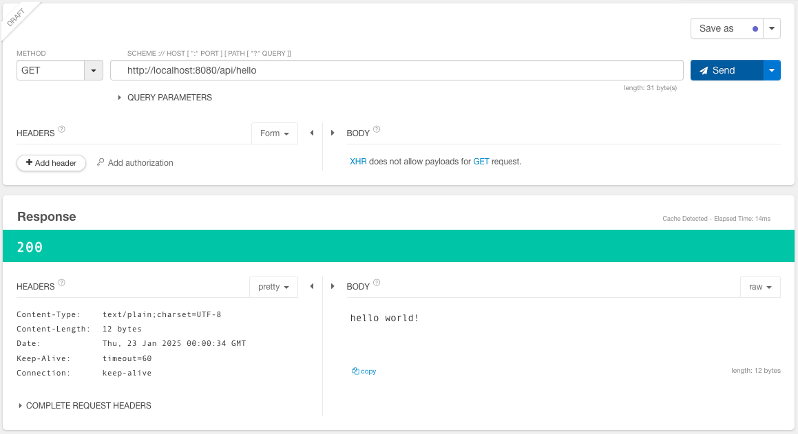
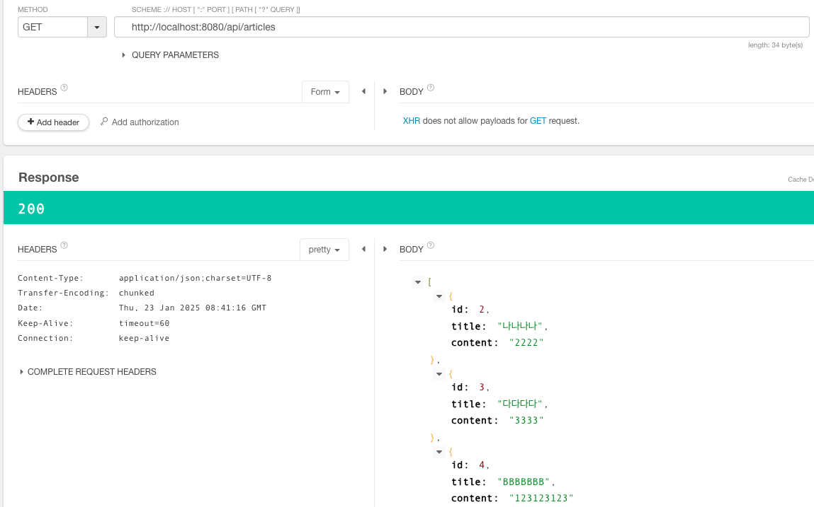

# 스프링 부트3 자바 백엔드 개발 입문 - 11일차

## 오늘의 학습 목차

- 11.1 REST API의 동작 이해하기
- 11.2 REST API의 구현 과정
- 11.3 REST API 구현하기

## 11.1 REST API의 동작 이해하기

이전 10장에서 살펴봤던 내용을 되짚어보면, 클라이언트의 요청에 따른 서버의 응답에는 데이터가 담겨 있고 이러한 방식을 **REST API** 라고 했다.

- `REST`: HTTP URL로 서버의 자원(resource)을 명시하고, HTTP 메서드(POST, GET, PATCH/PUT, DELETE)로 해당 자원에 대해 CRUD 하는 것을 말한다.
- `API`: 클라이언트가 서버의 자원을 요청할 수 있도록 서버에서 제공하는 인터페이스다.

REST API를 잘 구현하면 🐬 클라이언트가 기기에 구애받지 않고 서버의 자원을 이용할 수 있고, 서버가 클라이언트 요청에 체계적으로 대응할 수 있어서 서버 프로그램의 재사용성과 확장성이 좋아진다. 🐬

## 11.2 REST API의 구현 과정

REST API를 구현하기 위해서 URL을 설계해야 한다. ⚙️ 개인적으로, 이 단계가 잘 수행되어야 개발을 할 때 차질이 없다.

- 조회 요청 : `/api/articles` (전체 조회), `/api/aritcles/{id}` (단일 조회) with GET
- 생성 요청 : `/api/articles` with POST
- 수정 요청 : `/api/articles/{id}` with PATCH/PUT
- 삭제 요청 : `/api/articles/{id}` with DELETE

주소 설계가 끝났다면 URL 요청을 받아서 JSON으로 반환해 줄 컨트롤러를 만들어야 한다. 게시판을 만들 때는 뷰 페이지를 반환하는 일반 컨트롤러를 사용했지만, REST API로 요청과 응답을 주고받을 때는 REST 컨트롤러를 사용한다.

## 11.3 REST API 구현하기

```java
@RestController // REST API용 컨트롤러
public class FirstApiController {

    @GetMapping("/api/hello")
    public String hello() {
        return "hello world!";
    }
}
```

위 컨트롤러를 작성하고 나서 서버를 실행시키고, Talend에서 localhost:8080/api/hello로 GET 요청을 보내면 다음과 같은 데이터를 받을 수 있다.



이전에 mustache 파일의 이름을 반환하던 일반 컨트롤러는 응답 body에 html을 실었다면, REST 컨트롤러는 데이터를 담아서 보낸다.

### 11.3.2 REST API: GET 구현하기

먼저 전체 게시글을 조회하는 컨트롤러 메서드를 구현하자.

```java
@GetMapping("/api/articles")
public List<Article> index() {
    return articleRepository.findAll();
}
```

이번에는 id 값을 활용하여 단일 게시글을 조회하자.

```java
@GetMapping("/api/articles/{id}")
public Article show(@PathVariable Long id) {
    return articleRepository.findById(id).orElse(null);
}
```

### 11.3.3 REST API: POST 구현하기

```java
@PostMapping("/api/articles")
public Article create(@RequestBody ArticleForm dto) {
    Article article = dto.toEntity();
    return articleRepository.save(article);
}
```

이전에 폼에서 작성한 내용으로 데이터를 생성할 떄는 매개변수로 dto를 받아 오기만 하면 됐지만, REST API에서 데이터를 생성할 때는 JSON 데이터를 받아와야 하므로 달라져야 한다.

그래서 `@RequestBody`라는 어노테이션을 활용한다.

### 11.3.4 REST API: PATCH 구현하기

```java
@PatchMapping("/api/articles/{id}")
public ResponseEntity<Article> update(@PathVariable Long id, @RequestBody ArticleForm dto) {
    Article article = dto.toEntity();
    log.info("id: {}, article: {}", id, article.toString());

    Article target = articleRepository.findById(id).orElse(null);
    if (target == null || id != article.getId()) {
        log.info("bad request, id: {}, article: {}", id, article.toString());
        return ResponseEntity.status(HttpStatus.BAD_REQUEST).body(null);
    }

    Article updated = articleRepository.save(article);
    return ResponseEntity.status(HttpStatus.OK).body(updated);
}
```

update(수정) 과정은 신경써야 할 부분이 있다.

일단 수정 폼으로부터 받은 dto를 엔티티 클래스인 Article로 바꿔야 하고, 일단 수정을 요청 받은 해당 id의 게시글이 이미 있는지 확인해야 한다.

만약 없거나, 수정 본문(body)에 담긴 id와 URL에 담긴 id가 다르다면 잘못된 요청(404)이므로 이를 처리해야 한다.

그래서 반환형을 `ResponseEntity<Article>`로 해야 한다.

> [!NOTE]
> 클래스 **ResponseEntity** 는 REST 컨트롤러의 반환형, 즉 REST API의 응답을 위해 사용하는 클래스이다. REST API의 요청을 받아 응답할 때 클래스에 HTTP 상태 코드, 헤더, 본문을 담아 보낼 수 있다. **HttpStatus** 는 HTTP 상태 코드를 관리하는 클래스로 다양한 Enum 타입과 관련한 메서드를 가지고 있다.

❌ 하지만, 위 코드는 일부 데이터를 수정할 때는 기존 데이터의 일부 필드를 null로 대체할 위험이 있다. ❌

```java
@PatchMapping("/api/articles/{id}")
public ResponseEntity<Article> update(@PathVariable Long id, @RequestBody ArticleForm dto) {
    Article article = dto.toEntity();
    log.info("id: {}, article: {}", id, article.toString());

    Article target = articleRepository.findById(id).orElse(null);
    if (target == null || id != article.getId()) {
        log.info("bad request, id: {}, article: {}", id, article.toString());
        return ResponseEntity.status(HttpStatus.BAD_REQUEST).body(null);
    }

    target.patch(article);
    Article updated = articleRepository.save(target);
    return ResponseEntity.status(HttpStatus.OK).body(updated);
}

// entity/Article.java
public void patch(Article article) {
    if (article.title != null) {
        this.title = article.title;
    }
    if (article.content != null) {
        this.content = article.content;
    }
}
```

수정하고자 하는 target이 null이 아니면서, 수정 본문의 id와 요청 URL의 파라미터인 id가 동일할 때 target을 덮어쓰기하는 과정이 코드로 추가됐다. 이러한 구현을 통해 일부의 필드에 대해서만 수정이 가능하게 됐다!

### REST API: DELETE 구현하기

```java
@DeleteMapping("/api/articles/{id}")
public ResponseEntity<Article> delete(@PathVariable Long id) {
    Article target = articleRepository.findById(id).orElse(null);
    if (target == null) {
        return ResponseEntity.status(HttpStatus.BAD_REQUEST).body(null);
    }

    articleRepository.delete(target);
    return ResponseEntity.status(HttpStatus.OK).build();
}
```

URL 파라미터인 id에 해당하는 데이터가 있는지 찾고, 있으면 삭제하는 로직을 수행한다.

모든 메서드가 잘 실행되는지 확인해보자.

- 먼저 모든 데이터 조회 (O)
- 단일 데이터 조회 (O)
- 새로운 데이터 생성 (O)
- 전 단계에서 생성한 데이터의 title만 변경 (O)
- id가 1인 데이터 삭제 (O)
- 다시 모든 데이터 조회 (O)

결과는 다음과 같다.


