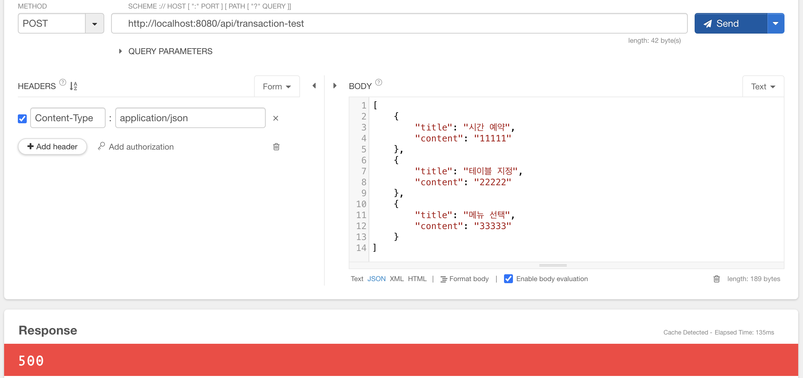
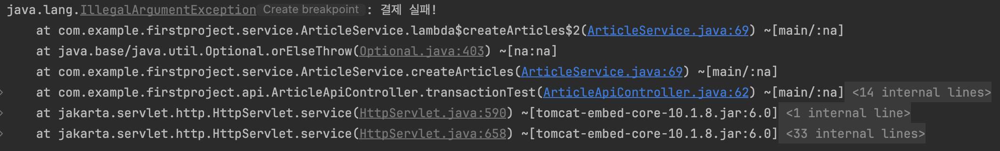

# 스프링 부트3 자바 백엔드 개발 입문 - 12일차

## 오늘의 학습 목차

- 12.1 서비스와 트랜잭션의 개념
- 12.2 서비스 계층 만들기
- 12.3 트랜잭션 맛보기

## 12.1 서비스와 트랜잭션의 개념

> [!IMPORTANT]
> 서비스란, 컨트롤러와 레포지토리 사이에 위치하는 계층으로 서버의 핵심 기능(비즈니스 로직)을 처리하는 순서를 총괄한다.

식당을 예로 들어보자면,

- 주문을 받는 웨이터는 컨트롤러다. 고객의 주문에 따라 음식을 주방장에게 요청한다.
- 주방장은 서비스다. 실제로 식당의 비즈니스에 맞게 요리를 만들어낸다.
- 보조 요리사는 레포지토리다. 주방은 음식을 만드는 데 필요한 재료를 가져오도록 보조 요리사를 시킬 수 있다.

> [!IMPORTANT]
> 트랜잭션(transaction)은 모두 성공해야 하는 일련의 과정을 뜻한다. 일반적으로 서비스 업무 처리는 트랜잭션 단위로 진행된다.

이번에는 식당 예약을 예로 들어보자.

1. 시간 예약
2. 테이블 지정
3. 메뉴 선택
4. 결제
5. 영수증 발행
6. 예약 완료

어떤 고객이 메뉴 선택까지 완료했다 하더라도, 결제가 되지 않으면 앞서 진행한 기록은 모두 취소돼야 한다. 1번부터 6번의 일련의 과정은 트랜잭션이다. 그리고 실패로 돌아갈 경우 진행 초기 단계로 돌리는 것을 **롤백(rollback)** 이라 한다.

11장까지는 컨트롤러 메서드 안에 서비스의 역할도 혼재되어 있기 때문에 이를 분리하는 과정이 필요하다!

## 12.2 서비스 계층 만들기

ArticleApiController에 있는 바로 레포지토리로 접근하던 메서드를 모두 주석처리하자.

서비스 객체 주입을 위해 다음과 같은 코드를 클래스 내 상단에 적자.

```java
@Autowired
private ArticleService articleService; // 서비스 객체 주입
```

서비스 객체를 생성한 적이 없으므로, service 패키지 내에 ArticleService 클래스를 생성한다.

그리고 서비스가 레포지토리 클래스에 접근할 수 있도록 레포지토리 객체를 주입해주자.

### 12.2.2 게시글 생성 요청 개선하기

원래 컨트롤러에 있던 create 메서드는 다음과 같다.

```java
@PostMapping("/api/articles")
public Article create(@RequestBody ArticleForm dto) {
    Article article = dto.toEntity();
    return articleRepository.save(article);
}
```

dto 타입의 객체를 엔티티 객체로 바꾸고, DB에 저장하는 일은 서비스 계층에서 담당해야 하므로 이를 옮기자. 그리고 데이터 생성 여부에 따라 상태(status)와 데이터를 보내도록 하자.

```java
// ArticleApiContoller.java
@PostMapping("/api/articles")
public ResponseEntity<Article> create(@RequestBody ArticleForm dto) {
    Article created = articleService.create(dto); // 서비스 계층으로 데이터를 넘기기만 하면 된다.
    return (created != null) ?
        ResponseEntity.status(HttpStatus.OK).body(created) :
        ResponseEntity.status(HttpStatus.BAD_REQUEST).build();
}
```

서비스 계층에서 create라는 메서드를 만들어 기존에 컨트롤러에서 담당하던 일을 그대로 수행하면 된다.

```java
public Article create(ArticleForm dto) {
    Article article = dto.toEntity();
    return articleRepository.save(article);
}
```

📌 그런데 여기서 문제가 있다. id가 1인 데이터에 title과 content를 입력한 후 POST 요청을 보내면 1번 데이터를 수정한다. 이러면, 생성의 목적에서 벗어나게 되므로 이를 막기 위해 id 값이 있으면 save 메서드를 호출할 수 없게 막아야 한다.

```java
public Article create(ArticleForm dto) {
    Article article = dto.toEntity();
    if (article.getId != null) {
        return null;
    }
    return articleRepository.save(article);
}
```

서비스에서 비즈니스 로직과 관련된 내용을 모두 처리하고, 컨트롤러가 요청을 받고 응답을 보내는 일을 담당하도록 분리하니까 코드가 하는 일이 명확해졌다.

아래는 완성된 서비스 코드이다.

```java
@Service
public class ArticleService {
    @Autowired
    private ArticleRepository articleRepository;

    public List<Article> index() {
        return articleRepository.findAll();
    }

    public Article show(Long id) {
        return articleRepository.findById(id).orElse(null);
    }

    public Article create(ArticleForm dto) {
        Article article = dto.toEntity();
        return articleRepository.save(article);
    }

    public Article update(Long id, ArticleForm dto) {
        Article article = dto.toEntity();

        Article target = articleRepository.findById(id).orElse(null);
        if (target == null || id != article.getId()) {
            return null;
        }

        target.patch(article);
        return articleRepository.save(target);
    }

    public Article delete(Long id) {
        Article target = articleRepository.findById(id).orElse(null);

        if (target == null) {
            return null;
        }

        articleRepository.delete(target);
        return target;
    }
}
```

## 12.3 트랜잭션 맛보기

트랜잭션 앞서 말했듯이 반드시 성공해야만 하는 일련의 과정이면서, 한 묶음이다. 성공하지 못하면 원래 상태로 복구, 롤백되는지 확인하는 테스트를 진행해보자.

시나리오는 다음과 같다.

1. 게시판에 데이터 3개를 한꺼번에 생성 요청하기
2. 데이터를 DB에 저장하는 과정에서 의도적으로 오류 발생시키기
3. 어떻게 롤백되는지 확인하기

먼저 트랜잭션 테스트를 받아줄 컨트롤러 메서드를 작성하자.

```java
@PostMapping("/api/transaction-test")
public ResponseEntity<List<Article>> transactionTest(@RequestBody List<ArticleForm> dtos) {
    List<Article> createdList = articleService.createArticles(dtos);
    return (createdList != null) ?
        ResponseEntity.status(HttpStatus.OK).body(createdList) :
        ResponseEntity.status(HttpStatus.BAD_REQUEST).build();
}
```

그 다음에 서비스 계층에 메서드를 만든다.

```java
public List<Article> createArticles(List<ArticleForm> dtos) {
    // 1. dto 묶음을 엔티티 묶음으로 변환하기
    List<Article> articleList = dtos.stream()
        .map(dto -> dto.toEntity())
        .collect(Collectors.toList());

    // 2. 엔티티 묶음을 DB에 저장하기
    articleList.stream()
        .forEach(article -> articleRepository.save(article));

    // 3. 강제 예외 발생시키기
    articleRepository.findById(-1L)
        .orElseThrow(() -> new IllegalArgumentException("결제 실패!"));

    // 4. 결과 값 반환하기
    return articleList;
}
```

> [!NOTE]
> 스트림(stream) 문법은 리스트와 같은 자료구조에 저장된 요소를 하나씩 순회하면서 처리하는 코드 패턴이다. 일반 for을 사용할 때보다 훨씬 적은 코드로 로직을 수행할 수 있다.

일부러 트랜잭션을 실패하게 만들어야 하므로 강제 예외를 발생시키는 코드가 들어있다. 서버를 실행해서 해당 URL로 요청을 보내보자.

500 에러와 함께 '결제 실패!'라는 메시지와 함께 에러가 발생한다.





문제는 이후에 `http://localhost:8080/api/articles`에 GET 요청을 보내 모든 데이터를 조회해보면 방금 생성 요청한 데이터가 들어있다.

**⚠️ 데이터 생성에 실패했으니 데이터 3개는 남지 않도록 해야 한다!**

그 방법은 간단하다. 서비스의 메서드에 @Transactional이라는 어노테이션을 붙여서 하나의 트랜잭션으로 인식될 수 있게끔 만들 수 있다. 이제부터는 실패한 생성 요청 건에 대한 데이터는 남지 않는다.

완성된 서비스의 메서드이다.

```java
@Transactional // org.springframework.transaction.annotation
public List<Article> createArticles(List<ArticleForm> dtos) {
    // 1. dto 묶음을 엔티티 묶음으로 변환하기
    List<Article> articleList = dtos.stream()
        .map(dto -> dto.toEntity())
        .collect(Collectors.toList());

    // 2. 엔티티 묶음을 DB에 저장하기
    articleList.stream()
        .forEach(article -> articleRepository.save(article));

    // 3. 강제 예외 발생시키기
    articleRepository.findById(-1L)
        .orElseThrow(() -> new IllegalArgumentException("결제 실패!"));

    // 4. 결과 값 반환하기
    return articleList;
}
```
