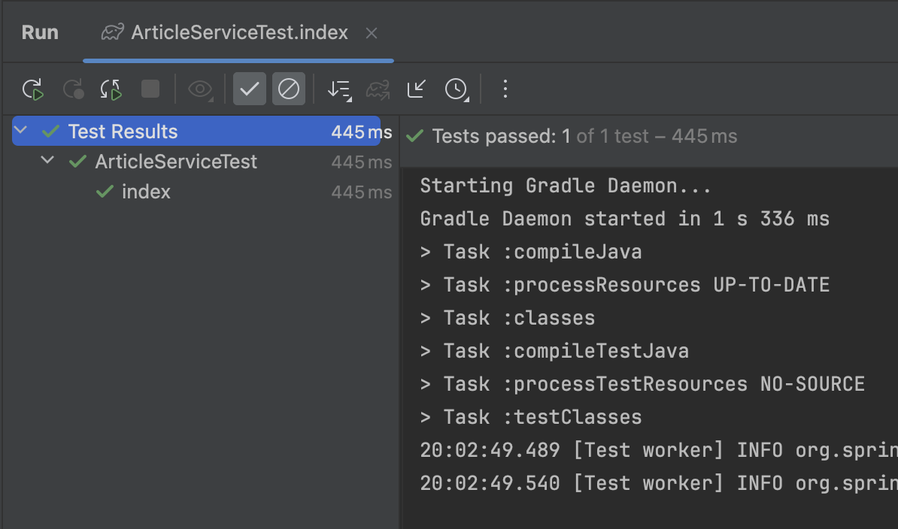
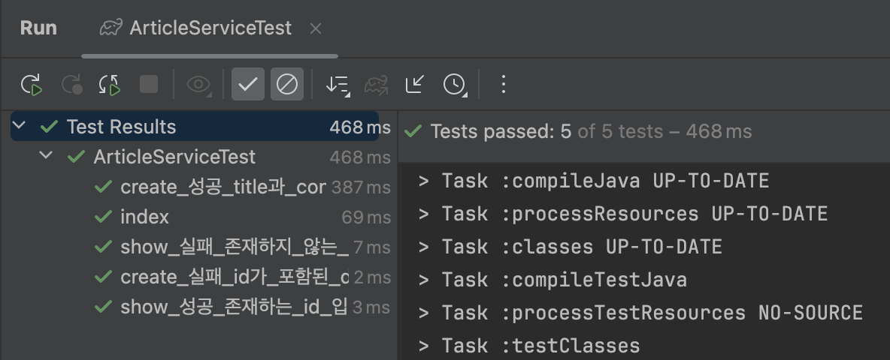

# 스프링 부트3 자바 백엔드 개발 입문 - 13일차

## 오늘의 학습 목차

- 13.1 테스트란
- 13.2 테스트 코드 작성하기

## 13.1 테스트란

> [!IMPORTANT]
> 테스트(Test)란 프로그램의 품질을 검증하는 것으로, 의도대로 프로그램이 잘 동작하는지 확인하는 과정이다. 최근에는 테스트 도구를 이용해서 반복적인 검증 절차를 자동화할 수 있다.

보통 테스트 코드는 다음 3단계로 진행한다.

1. 예상 데이터 작성하기
2. 실제 데이터 획득하기
3. 예상 데이터와 실제 데이터 비교해서 검증하기

테스트를 통과하지 못하면 **디버깅(debugging)** 을 통해 잘못된 부분을 고치고, 테스트를 통과하면 지속적인 리팩터링으로 코드를 개선해야 한다.

이를 기반으로 한 개발 방법론인 테스트 주도 개발이 핵심 패러다임으로 자리 잡고 있다.

> 테스트 주도 개발(TDD, Test Driven Development)이란 먼저 테스트 코드를 만든 후 이를 통과하는 최소한의 코드부터 시작해 점진적으로 코드를 개선하고 확장해 나가는 개발 방식이다.

## 13.2 테스트 코드 작성하기

ArticleService 클래스 내부에 있는 index() 메서드에 대한 테스트 코드를 작성해보자.

교재에서는 Testing library로 **JUnit5** 을 사용한다.

테스트와 관련된 파일은 src 디렉토리 아래에 test라는 이름으로 되어 있고 main처럼 비슷한 구조를 가지고 있다.

ArticleService 클래스에 대한 테스트 코드의 경로는 다음과 같다.

```text
test > java > com.example.firstproject > service > ArticleServiceTest
```

본격적으로 index() 메서드에 대한 테스트를 작성해보자.

```java
@SpringBootTest
class ArticleServiceTest {

    @Autowired
    ArticleService articleService;

    @Test
    void index() {
        // 1. 예상 데이터
        Article a = new Article(1L, "가가가가", "1111");
        Article b = new Article(2L, "나나나나", "2222");
        Article c = new Article(3L, "다다다다", "3333");
        List<Article> expected = new ArrayList<>(Arrays.asList(a, b, c));

        // 2. 실제 데이터
        List<Article> articles = articleService.index();

        // 3. 비교 및 검증
        assertEquals(expected.toString(), articles.toString());
    }
}
```

중요한 설정을 짚어보자.

- ArticleServiceTest 클래스 위에 **@SpringBootTest** 어노테이션을 붙여서 스프링 부트와 연동해 통합 테스트를 수행하겠다고 선언해야 한다. 이렇게 해야 테스트 코드에서 스프링 부트가 관리하는 다양한 객체를 주입받을 수 있다.
- 예상 데이터를 작성하는 부분은 data.sql 파일을 통해 먼저 생성하고자 하는 데이터를 참고하면 된다.
- 실제 데이터는 외부로부터 주입받은 ArticleService 객체를 활용하면 된다.
- JUnit이 제공하는 `org.junit.jupiter.api.Assertions.assertEquals`를 통해 서로 일치하는지 확인할 수 있다.

스프링 부트와 연동하느라 다소 시간이 걸리긴 하지만 다음과 같은 결과를 얻을 수 있다.



### 13.2.3 show() 테스트하기

```java
@Test
void show_성공_존재하는_id_입력() {
    // 1. 예상 데이터
    Long id = 1L;
    Article expected = new Article(id, "가가가가", "1111");

    // 2. 실제 데이터
    Article article = articleService.show(id);

    // 3. 비교 및 검증
    assertEquals(expected.toString(), article.toString());
}

@Test
void show_실패_존재하지_않는_id_입력() {
    // 1. 예상 데이터
    Long id = -1L;
    Article expected = null;

    // 2. 실제 데이터
    Article article = articleService.show(id);

    // 3. 비교 및 검증
    assertEquals(expected, article); // null은 toString() 메서드를 지원하지 않는다.
}
```

이런 식으로 성공과 실패의 경우를 나눠서 테스트 코드를 작성할 수 있다.

### 13.2.4 create() 테스트하기

```java
@Test
void create_실패_id가_포함된_dto_입력() {
    // 1. 예상 데이터
    Long id = 4L;
    String title = "라라라라";
    String content = "4444";
    ArticleForm dto = new ArticleForm(id, title, content);
    Article expected = null;

    // 2. 실제 데이터
    Article article = articleService.create(dto);

    // 3. 비교 및 검증
    assertEquals(expected, article);
}
```

create() 메서드 호출 후 데이터 생성에 실패했을 때를 가정하고 작성한 테스트 코드다. create() 메서드의 파라미터인 dto는 id 값이 포함되어 있으면 오류가 나고 null을 반환하도록 되어 있으므로 이를 반영하여 테스트할 수 있다.

### 13.2.5 여러 테스트 케이스 한 번에 실행하기

5개의 테스트를 동시에 수행하면 index()가 테스트를 통과하지 못하는 문제가 발생한다.

❓ 왜냐하면 `index()` 메서드를 실행하기 전에 `create_성공_title과_content만_있는_dto_입력()` 메서드를 실행하면서 데이터를 하나 추가했기 때문에 실제 데이터를 조회하면서 예상 데이터보다 하나 더 많은 상태가 되어 테스트에 실패한 것이다.

이러한 문제를 해결하기 위해서는 트랜잭션으로 처리해서 테스트가 끝나면 롤백할 수 있도록 **@Transactional** 어노테이션을 붙여줘야 한다.

> [!TIPS]
> 조회하는 테스트를 제외하고는 생성, 수정, 삭제의 경우 반드시 해당 테스트를 트랜잭션으로 묵어서 테스트가 종료된 후에 다시 돌아갈 수 있게 롤백 처리해줘야 한다.

create() 메서드와 관련된 모든 테스트 메서드를 트랜잭션으로 묶어보자.

```java
@Test
@Transactional
void create_성공_title과_content만_있는_dto_입력() {
    // 1. 예상 데이터
    String title = "라라라라";
    String content = "4444";
    ArticleForm dto = new ArticleForm(null, title, content);
    Article expected = new Article(4L, title, content);

    // 2. 실제 데이터
    Article article = articleService.create(dto);

    // 3. 비교 및 검증
    assertEquals(expected.toString(), article.toString());
}

@Test
@Transactional
void create_실패_id가_포함된_dto_입력() {
    // 1. 예상 데이터
    Long id = 4L;
    String title = "라라라라";
    String content = "4444";
    ArticleForm dto = new ArticleForm(id, title, content);
    Article expected = null;

    // 2. 실제 데이터
    Article article = articleService.create(dto);

    // 3. 비교 및 검증
    assertEquals(expected, article);
}
```

5개의 테스트가 모두 성공한 모습이다.


