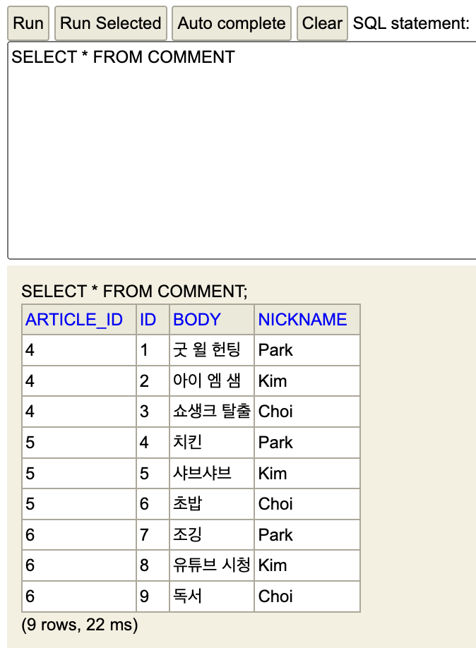
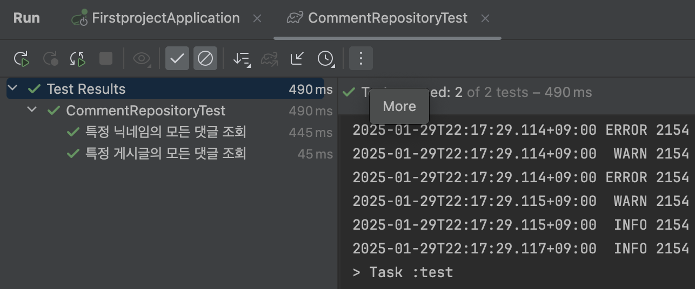

# 스프링 부트3 자바 백엔드 개발 입문 - 14일차

## 오늘의 학습 목차

- 14.1 댓글 기능의 개요
- 14.2 댓글 엔티티 만들기
- 14.3 댓글 리파지터리 만들기

## 14.1 댓글 기능의 개요

### 14.1.1 댓글과 게시글의 관계

하나의 게시글에 수많은 댓글이 달리므로 게시글과 댓글은 **일대다(one-to-many) 관계** 라고 할 수 있다.

실제 DB에 게시글과 댓글은 어떻게 저장될까?

article 테이블과 comment 테이블은 각자 고유한 id, 즉 대표키(PK, Primary Key)를 가지고 있고 comment 테이블에는 연관 대상을 가리키는 article_id, 즉 외래키(FK, Foreign Key)를 가지고 있다.

만약 댓글 레코드의 article_id 속성 값이 4라면, 4번 id를 가진 게시글 레코드와 관계가 있음을 의미한다.

### 14.1.2 댓글 엔티티와 리파지터리 설계

엔티티와 리파지터리 개념을 복습해보자.

- `엔티티` : DB 데이터를 담는 자바 객체로, 엔티티를 기반으로 테이블 생성
- `리파지터리` : 엔티티를 관리하는 인터페이스로, 데이터 CRUD 등의 기능 제공

Article 엔티티와 ArticleRepository를 작성한 것처럼, Comment 엔티티와 CommentRepository를 작성해야 하는데 이번에는 CommentRepository가 CrudRepository 대신 JpaRepository를 상속받도록 하자.

참고로 **JpaRepository** 는, CrudRepository를 상속받는 ListCrudRepository를 상속받는다. 그리고 엔티티의 페이징 및 정렬 기능을 제공하는 PagingAndSortingRepository와 ListPagingAndSortingRepository도 상속받는다.

## 14.2 댓글 엔티티 만들기

Article 엔티티 클래스를 만들었던 패키지 아래 Comment 클래스를 작성한다.

```java
@Entity
@Getter
@ToString
@AllArgsConstructor
@NoArgsConstructor
public class Comment {
    @Id
    @GeneratedValue(strategy=GenerationType.IDENTITY) // DB가 자동으로 1씩 증가
    private Long id;

    @ManyToOne // 다대일 관계 설정
    @JoinColumn(name="article_id")
    private Article article;

    @Column
    private String nickname;

    @Column
    private String body;
}
```

JPA 프로그래밍에서는 `private Long article_id;`로 필드를 설정하지 않고 Article 엔티티를 다대일 관계로 설정하기 위해 직접 가져온다. 외래키 연결을 위해 **@JoinColumn** 어노테이션을 사용하고 name 속성으로 매핑할 외래키 이름을 지정한다.

그리고 더미 데이터 삽입을 위한 SQL 파일을 수정한다.

```sql
-- 기존 데이터
INSERT INTO article(title, content) VALUES( '가가가가', '1111');
INSERT INTO article(title, content) VALUES( '나나나나', '2222');
INSERT INTO article(title, content) VALUES( '다다다다', '3333');
-- article 테이블에 데이터 추가
INSERT INTO article(title, content) VALUES( '당신의 인생 영화는?', '댓글 고');
INSERT INTO article(title, content) VALUES( '당신의 소울 푸드는?', '댓글 고고');
INSERT INTO article(title, content) VALUES( '당신의 취미는?', '댓글 고고고');
-- 4번 게시글의 댓글 추가
INSERT INTO comment(article_id, nickname, body) VALUES(4, 'Park', '굿 윌 헌팅');
INSERT INTO comment(article_id, nickname, body) VALUES(4, 'Kim', '아이 엠 샘');
INSERT INTO comment(article_id, nickname, body) VALUES(4, 'Choi', '쇼생크 탈출');
-- 5번 게시글의 댓글 추가
INSERT INTO comment(article_id, nickname, body) VALUES(5, 'Park', '치킨');
INSERT INTO comment(article_id, nickname, body) VALUES(5, 'Kim', '샤브샤브');
INSERT INTO comment(article_id, nickname, body) VALUES(5, 'Choi', '초밥');
-- 6번 게시글의 댓글 추가
INSERT INTO comment(article_id, nickname, body) VALUES(6, 'Park', '조깅');
INSERT INTO comment(article_id, nickname, body) VALUES(6, 'Kim', '유튜브 시청');
INSERT INTO comment(article_id, nickname, body) VALUES(6, 'Choi', '독서');
```

스프링부트 어플리케이션 실행 후 h2-console에서 데이터를 조회한 모습이다.



## 14.3 댓글 리파지터리 만들기

CrudRepository 인터페이스와 다르게 **🧩페이지 처리와 정렬 작업🧩** 까지 수행할 수 있는 JpaRepository 인터페이스를 상속받는 CommentRepository를 만들어보자.

```java
public interface CommentRepository extends JpaRepository<Comment, Long> {
    // 특정 게시글의 모든 댓글 조회
    @Query(value = "SELECT * FROM comment WHERE article_id = :articleId", nativeQuery = true)
    List<Comment> findByArticleId(Long articleId);

    // 특정 닉네임의 모든 댓글 조회
    List<Comment> findByNickname(String nickname);
}
```

JpaRepository를 상속받는 부분에서 Comment 엔티티를 관리하므로 대상 엔티티에는 Comment, 대표키(PK) 값의 타입에는 id의 타입인 Long을 넣으면 된다.

해당 인터페이스 안에는 @Query 어노테이션과 함께 쿼리문이 들어 있는 것을 확인할 수 있는데, 직접 작성한 SQL 쿼리를 리파지터리 메서드로 실행할 수 있게 하는 네이티브 **쿼리 메서드(native query method)** 를 사용하기 위함이다.

> [!NOTE]
> @Query 어노테이션은 SQL과 유사한 JPQL(Java Persistence Query Language)이라는 객체 지향 쿼리 언어를 통해 복잡한 쿼리 처리를 지원한다. 그러나, nativeQuery 속성을 true로 하면 기존 SQL문을 그대로 사용할 수 있다. 주의해야 할 점은 ⚠️ WHERE 절에 조건을 쓸 때 매개 변수 앞에는 콜론(:)을 써줘야 한다.

특정 닉네임의 모든 댓글 조회를 위한 메서드에는 @Query 어노테이션이 안붙어 있는데, 그 이유는 네이티브 쿼리 XML을 통해서도 수행할 쿼리를 지정해줄 수 있다.

resources 디렉토리 아래 META-INF를 만들고 거기에 orm.xml 파일을 만들자.

> [!WARNING]
> 디렉터리 이름은 무조건 META-INF여야 한다.

orm.xml에 작성해야 하는 내용은 다음과 같은데 xml의 틀은 굳이 외우지 않아도 된다.

```xml
<?xml version="1.0" encoding="utf-8" ?>
<entity-mappings xmlns="https://jakarta.ee/xml/ns/persistence/orm"
                 xmlns:xsi="http://www.w3.org/2001/XMLSchema-instance"
                 xsi:schemaLocation="https://jakarta.ee/xml/ns/persistence/orm https://jakarta.ee/xml/ns/persistence/orm/orm_3_0.xsd"
                 version="3.0">
    <named-native-query name="Comment.findByNickName" result-class="com.example.firstproject.entity.Comment">
        <query>
            <![CDATA[
                SELECT * FROM comment WHERE nickname = :nickname
            ]]>
        </query>
    </named-native-query>
</entity-mappings>
```

약간의 설명을 하자면,

- `<named-native-query>` 태그의 name 속성에는 쿼리를 수행하는 대상 엔티티.메서드 이름을 적는다.
- result-class 속성에는 쿼리가 반환하는 타입의 전체 패키지 경로를 적는다.
- `<query>` 태그에는 실제 수행할 쿼리를 적는다. 이때 쿼리는 `<![CDATA[]]>` 구문 안에 적는데, Character DATA, 즉 파싱(구문 분석)되지 않은 문자 데이터를 쓸 때 사용한다. 이 구문을 사용해야 대소 비교 연산 등에 문제가 생기지 않는다.

### 14.3.2 댓글 리파지터리 테스트 코드 작성하기

리파지터리에 있는 두 메서드에 대해 테스트 코드를 작성하기 위해 CommentRepositoryTest 클래스를 마련한다.

그리고 테스트 코드는 다음과 같다.

```java
@Test
@DisplayName("특정 게시글의 모든 댓글 조회") // 테스트 이름을 명시
void findByArticleId() {
    /* Case 1: 4번 게시글의 모든 댓글 조회 */
    {
        // 1. 입력 데이터 준비
        Long articleId = 4L;

        // 2. 실제 데이터
        List<Comment> comments = commentRepository.findByArticleId(articleId);

        // 3. 예상 데이터
        Article article = new Article(4L, "당신의 인생 영화는?", "댓글 고");
        Comment a = new Comment(1L, article, "Park", "굿 윌 헌팅");
        Comment b = new Comment(2L, article, "Kim", "아이 엠 샘");
        Comment c = new Comment(3L, article, "Choi", "쇼생크 탈출");
        List<Comment> expected = Arrays.asList(a, b, c);

        // 4. 비교 및 검증
        assertEquals(expected.toString(), comments.toString(), "4번 글의 모든 댓글을 출력!");
    }

    /* Case 2: 1번 게시글의 모든 댓글 조회 */
    {
        // 1. 입력 데이터 준비
        Long articleId = 1L;

        // 2. 실제 데이터
        List<Comment> comments = commentRepository.findByArticleId(articleId);

        // 3. 예상 데이터
        Article article = new Article(1L, "가가가가", "1111");
        List<Comment> expected = Arrays.asList();

        // 4. 비교 및 검증
        assertEquals(expected.toString(), comments.toString(), "1번 글은 댓글이 없음");
    }
}
```

댓글이 있는 게시글이 있고, 댓글이 없는 게시글이 있다는 점에 착안하여 테스트 코드를 작성한다.

이번에는 findByNickname() 메서드에 대한 테스트다.

```java
@Test
@DisplayName("특정 닉네임의 모든 댓글 조회")
void findByNickname() {
    /* Case 1: "Park"의 모든 댓글 조회 */
    {
        // 1. 입력 데이터 준비
        String nickname = "Park";

        // 2. 실제 데이터
        List<Comment> comments = commentRepository.findByNickname(nickname);

        // 3. 예상 데이터
        Comment a = new Comment(1L, new Article(4L, "당신의 인생 영화는?", "댓글 고"), nickname, "굿 윌 헌팅");
        Comment b = new Comment(4L, new Article(5L, "당신의 소울 푸드는?", "댓글 고고"), nickname, "치킨");
        Comment c = new Comment(7L, new Article(6L, "당신의 취미는?", "댓글 고고고"), nickname, "조깅");
        List<Comment> expected = Arrays.asList(a, b, c);

        // 4. 비교 및 검증
        assertEquals(expected.toString(), comments.toString(), "Park의 모든 댓글을 출력!");
    }
}
```

CommentRepositoryTest 클래스에 들어 있는 모든 테스트 메서드에 대한 테스트 결과이다.


