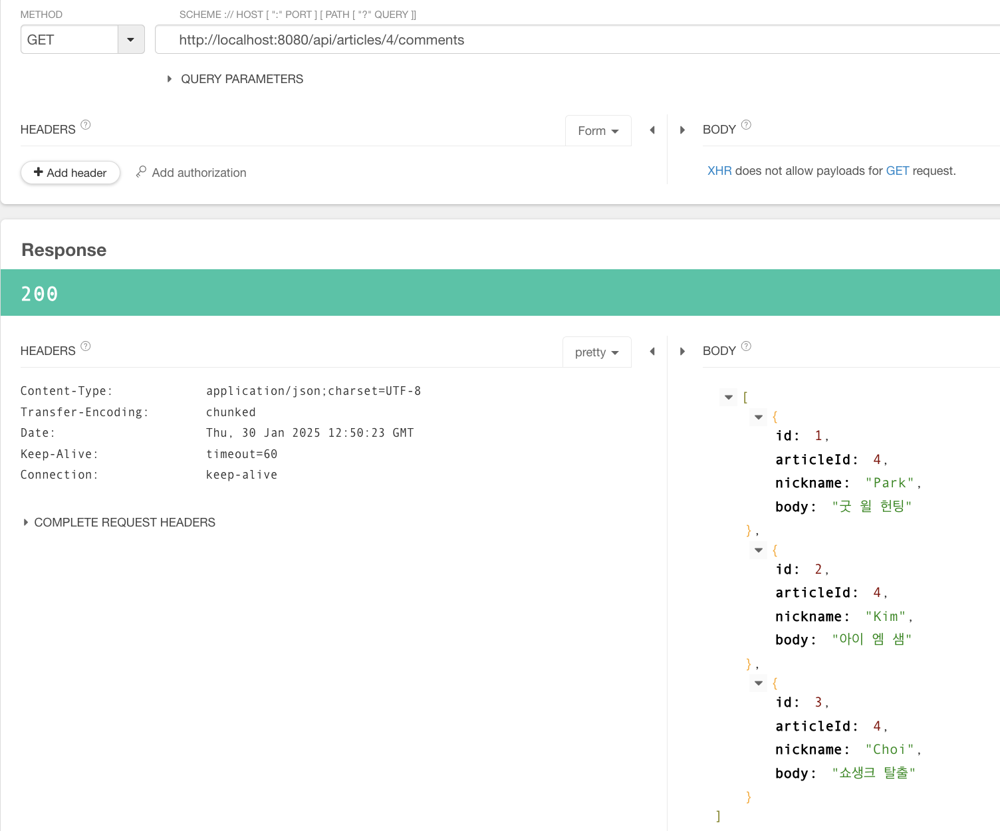

# 스프링 부트3 자바 백엔드 개발 입문 - 15일차

## 오늘의 학습 목차

- 15.1 댓글 REST API의 개요
- 15.2 댓글 컨트롤러와 서비스 틀 만들기
- 15.3 댓글 조회하기

## 15.1 댓글 REST API의 개요

이번 장에서는 댓글 REST 컨트롤러, 서비스, DTO를 만들어 댓글 CRUD를 위한 REST API를 완성한다.

- `REST 컨트롤러` : 댓글 REST API를 위한 컨트롤러로 서비스와 협업하고, 클라이언트 요청을 받아 응답하며 뷰(view)가 아닌 데이터를 반환한다.
- `서비스` : REST 컨트롤러와 리파지터리 사이에서 비즈니스 로직, 즉 처리 흐름을 담당하며 예외 상황이 발생했을 때 @Transactional로 변경된 데이터 롤백
- `DTO` : 사용자에게 보여 줄 댓글 정보를 담은 것으로, 단순히 클라이언트와 서버 간에 댓글 JSON 데이터 전송에 사용된다.

댓글 CRUD를 수행하기 위해서 REST API가 필요하다. 이번에는 다음과 같이 주소를 설계한다.

- GET : /articles/articleId/comments
- POST : /articles/articleId/comments
- PATCH : /comments/id
- DELETE : /comments/id

## 15.2 댓글 컨트롤러와 서비스 틀 만들기

댓글 컨트롤러인 CommentApiController, 그리고 댓글 컨트롤러와 협업할 CommentService 클래스의 틀만 만들어 놓자.

```java
// CommentApiController
@RestController // REST 컨트롤러 선언
public class CommentApiController {
    @Autowired
    private CommentService commentService; // 댓글 서비스 객체 주입
}
```

```java
// CommentService
@Service
public class CommentService {
    @Autowired
    private CommentRepository commentRepository;

    @Autowired
    private ArticleRepository articleRepository;

    // 1. 댓글 조회
    // 2. 댓글 생성
    // 3. 댓글 수정
    // 4. 댓글 삭제
}
```

CommentService 클래스에 ArticleRepository의 객체 주입이 필요한 이유는 게시글 리파지터리가 있어야 댓글을 생성할 때 대상 게시글의 존재 여부를 파악할 수 있기 때문이다.

## 15.3 댓글 조회하기

게시글 번호에 따라 모든 댓글을 불러오는 메서드를 작성하려고 한다.

```java
// CommentApiController
@GetMapping("/api/articles/{articleId}/comments")
public ResponseEntity<List<CommentDto>> comments(@PathVariable Long articleId) {
    // 서비스에 위임
    List<CommentDto> dtos = commentService.comments(articleId);

    // 결과 응답
    // 성공하는 경우만 있고 예외 처리를 스프링 부트에 맡긴다고 가정하
    return ResponseEntity.status(HttpStatus.OK).body(dtos);
}
```

위 메서드에서 아직 작성하지 않은 것은 엔티티를 단순히 클라이언트-서버 간 데이터 전송을 위해 변환한 Dto 클래스인 CommentDto이고, CommentService에 comments() 메서드이다.

```java
// CommentDto
@AllArgsConstructor
@NoArgsConstructor
@Getter
@ToString
public class CommentDto {
    private Long id;
    private Long articleId;
    private String nickname;
    private String body;

    public static CommentDto createCommentDto(Comment comment) {
        return new CommentDto(
                comment.getId(),
                comment.getArticle().getId(),
                comment.getNickname(),
                comment.getBody()
        );
    }
}
```

엔티티 클래스에서는 직접적인 테이블 간의 연관 관계를 위해 Article 클래스를 필드로 가져왔지만, 단순히 전송에 쓰이는 데이터는 Article의 Long 타입 id를 가져온다.

이번에는 comments() 메서드를 만들자.

```java
// CommentService
public List<CommentDto> comments(Long articleId) {
    // 1. 댓글 조회
    List<Comment> comments = commentRepository.findByArticleId(articleId);

    // 2. 엔티티 -> DTO 변환
    List<CommentDto> dtos = new ArrayList<>();
    for (int i = 0; i < comments.size(); i++) {
        Comment c = comments.get(i);
        CommentDto dto = CommentDto.createCommentDto(c);
        dtos.add(dto);
    }

    // 3. 결과 반환
    return dtos;
}
```

comments() 메서드가 담당하는 일은 리파지토리로부터 조회한 댓글을 CommentDto로 형변환하고 컨트롤러에게 전달하는 일이다.

여기서 아직 만들지 않은 createCommentDto() 메서드를 만들자.

```java
// CommentDto
public static CommentDto createCommentDto(Comment comment) {
    return new CommentDto(
            comment.getId(),
            comment.getArticle().getId(),
            comment.getNickname(),
            comment.getBody()
    );
}
```

여기서 주목해야 할 점은 static 키워드를 사용하여 메서드를 만들었다는 점이다. 이 키워드는 createCommentDto()가 객체(인스턴스) 생성 없이 호출 가능한 정적 메서드를 가리킬 때 사용한다. 정적(생성) 메서드를 사용한 이유를 유추해보자면, 엔티티 -> DTO 변환에 자주 사용되기 때문이지 아닐까 싶다.❓

실제로 서버를 시작하고 4번 게시글과 연관된 모든 댓글을 조회하면 다음과 같은 결과를 볼 수 있다.



++ 번외로 엔티티 -> DTO 변환을 위한 for 문을 stream 사용으로 리팩터링할 수 있다.

```java
// CommentService
public List<CommentDto> comments(Long articleId) {
    return commentRepository.findByArticleId(articleId) // 댓글 엔티티 목록 조회
            .stream() // 댓글 엔티티 목록을 스트림으로 변환
            .map(comment -> CommentDto.createCommentDto(comment)) // 엔티티를 DTO로 매핑
            .collect(Collectors.toList()); // 스트림을 리스트로 변환
}
```
