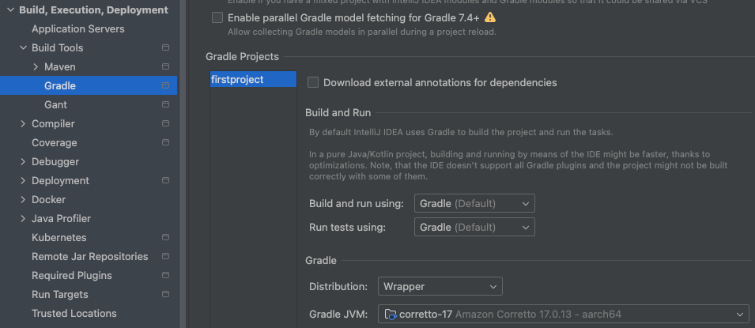

# 스프링 부트3 자바 백엔드 개발 입문 - 1일차

## 오늘의 학습 목차

- 1.1 스프링 부트란
- 1.2 스프링 부트 개발 환경 설정하기
- 1.3 웹 서비스의 동작 원리 이해하기

## 1.1 스프링 부트란

**스프링 부트란 자바 웹 프로그램을 더욱 쉽고 빠르게 만들어주는 도구이다.** 스프링 프레임워크(Spring framework)에서 버전에 따라 동작하는 외부 라이브러리를 일일이 연동해야 하지만, 스프링 부트는 외부 라이브러리를 최적화해서 제공하므로 사용자가 직접 연동할 필요가 없다. 또한, 스프링 부트는 내부에 웹 어플리케이션 서버(WAS)인 톰캣을 가지고 있어서, 웹 서비스를 jar 파일로 간편하게 배포할 수 있다.

## 1.2 스프링 부트 개발 환경 설정하기

> [!NOTE]
> JDK와 IntelliJ IDE 설치 순서 위주로 작성하기보다 중간에 생기는 오류를 해결하는 방식으로 작성했습니다...!

> [!IMPORTANT]
> JDK란? - Java 어플리케이션 개발을 위한 소프트웨어 개발 키트다. 주요한 구성 요소로는 JRE(Java 어플리케이션을 실행할 수 있는 환경)과 javac(자바 컴파일러) 등의 개발 도구가 있다.

`firstproject` 프로젝트를 책에 나와 있는대로 설정을 마치고 나면, build 오류를 마주하게 된다. 에러를 요약하자면, 다음과 같다.

> Failed to calculate the value of task ':compileJava' property 'javaCompiler'

이 에러는 스프링 부트 버전 3.1.0과 JDK 21.0.4 버전이 맞지 않아 나타나는 오류로, 아래처럼 설정해주고 sync 버튼 클릭을 통해 설정을 리프레쉬 해줘야 한다.

이전에는 FirstprojectApplication.java의 엔트리 포인트인 main() 함수 옆에 자동으로 재생 버튼이 보이지 않았다면, build가 성공하고 나서부턴 잘 보이고, 눌렀을 때 실행된다.

## 1.3 웹 서비스의 동작 원리 이해하기

### 1.3.1 클라이언트-서버 구조

웹 서비스는 클라이언트(브라우저)의 요청에 따른 서버(스프링 부트)의 응답으로 동작한다. 접근할 수 있는 아무런 자원(resource)도 없는 상태더라도 서버가 실행되어 있다면, 브라우저는 요청을 보낼 수 있고 에러 페이지를 응답받을 수 있다.

### 1.3.2 localhost:8080/hello.html의 의미

- localhost: 실행 중인 서버의 주소 중 **내 컴퓨터**를 의미한다. IP 주소로 변경하면 127.0.0.1이 된다.
- 8080: 웹 서버인 톰캣이 실행되고 있는 포트번호를 의미한다. localhost가 우리 집이었다면, 8080은 하나의 방이라고 비유할 수도 있다.
- hello.html은 서버에 요청하는 파일이다. 파일을 직접 지정할 경우에 스프링 부트는 기본적으로 src > main > resources > static 디렉터리에서 파일을 찾는다.
