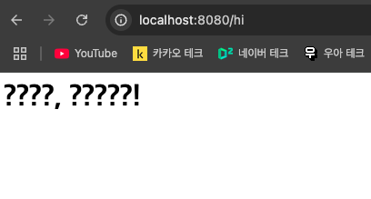
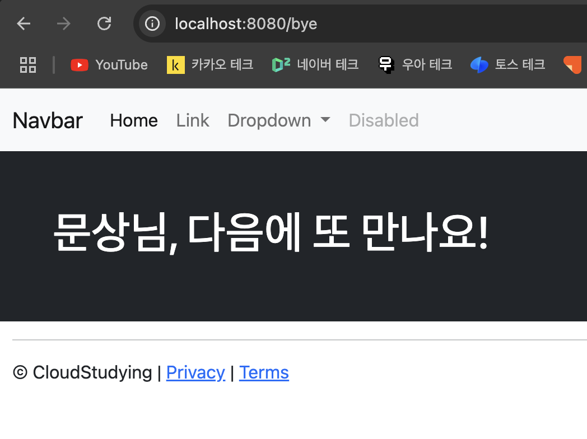

# 스프링 부트3 자바 백엔드 개발 입문 - 2일차

## 오늘의 학습 목차

- 2.1 뷰 템플릿과 MVC 패턴
- 2.2 MVC 패턴을 활용해 뷰 템플릿 페이지 만들기
- 2.3 MVC의 역할과 실행 흐름 이해하기
- 2.4 뷰 템플릿 페이지에 레이아웃 적용하기

## 2.1 뷰 템플릿과 MVC 패턴

> [!NOTE]
> 뷰 템플릿(View Template)이란 화면을 담당하는 기술로, 웹 페이지를 하나의 틀로 만들고 여기에 변수를 삽입해서 서로 다른 페이지를 보여 준다.

우리는 뷰 템플릿을 만드는 도구로 머스태치(번역: 콧수염)를 설치했다.

---

화면을 담당하는 뷰 템플릿이 '뷰'라는 개념이라면 '컨트롤러'와 '모델'이라는 개념도 함께 있다.

> [!IMPORTANT]
> 컨트롤러(controller)는 클라이언트의 요청을 처리하는 서버의 한 요소이다. 모델(model)은 데이터를 관리하는 역할을 한다.

모델-뷰-컨트롤러로 역할을 나누는 기법을 `MVC 패턴`이라 일컫는다.

## 2.2 MVC 패턴을 활용해 뷰 템플릿 페이지 만들기

클라이언트의 특정 URL로 요청이 있을 때, 서버에서 뷰 템플릿을 반환하기 위한 과정은 다음과 같다.

1. `greetings.mustache`라는 뷰 템플릿을 src > main > resources > templates 디렉토리 아래 만든다. (.mustache 확장 파일의 작성은 html 작성과 비슷하다...!)
2. 클라이언트의 요청을 처리하기 위해 @Controller 어노테이션이 붙은 FirstController.java를 작성한다. 어떤 URL에 매핑되어야 할 컨트롤러인지를 명시하기 위해서 메서드 상단에 @GetMapping 어노테이션을 사용한다.
3. 어플리케이션을 실행하고 localhost:8080/hi로 요청을 보내본다.

그런데, 다음과 같은 화면을 볼 수 있다.



> [!WARNING]
> 실행 결과 한글 깨짐 현상이 발생하면 src > main > resources > application.properties 파일을 열어서 server.servlet.encoding.force=true 코드를 추가하고 서버를 재시작하면 된다.

하지만, 여전히 변수의 흔적은 보이지 않고 정적 페이지와 다름이 없다. 먼저, mustache 확장 파일에 변수를 추가하자.

```html
<html lang="en">
  <head>
    <meta charset="UTF-8" />
    <meta name="viewport" content="width=device-width, initial-scale=1" />
    <title>Document</title>
  </head>
  <body>
    <!-- 콧수염 문법을 통해 원하는 변수를 넣을 수 있다. -->
    <h1>{{username}}님, 반갑습니다!</h1>
  </body>
</html>
```

그 다음으로는, 컨트롤러에서 뷰로 전달될 변수를 등록하기 위해 MVC 패턴에서 데이터를 관리하는 모델을 추가할 수 있다.

```java
package com.example.firstproject.controller;

import org.springframework.stereotype.Controller;
import org.springframework.ui.Model;
import org.springframework.web.bind.annotation.GetMapping;

@Controller
public class FirstController {

    @GetMapping("/hi")
    public String niceToMeetYou(Model model) {
        model.addAttribute("username", "문상");
        return "greetings";
    }
}
```

> [!NOTE]
> 컨트롤러에서 다루고 있는 Model은 대체 뭘까❓ - Spring MVC의 Model은 컨트롤러에서 뷰에 데이터를 전달하기 위해 사용되는 인터페이스이다. 컨트롤러에서 데이터를 모델에 등록하면, 뷰는 이 모델에 접근해서 화면에 나타낼 수 있다. 보통 키-값 형태로 저장하고 Model에 추가된 데이터는 요청 범위(Request Scope) 내에서 관리된다.

## 2.3 MVC의 역할과 실행 흐름 이해하기

컨트롤러의 동작을 조금 더 자세히 이해해보자면,

```java
@Controller // 1. 컨트롤러 선언
public class FirstController {

    @GetMapping("/hi") // 2. URL 요청 접수
    // 3. 요청과 동시에 메서드 실행
    public String niceToMeetYou(Model model) { // 4. 뷰 템플릿에서 사용할 변수를 등록하기 위해 모델 객체를 매개변수로 가져옴
        model.addAttribute("username", "문상"); // 모델에서 사용할 변수 등록
        return "greetings"; // 메서드를 수행한 결과로 파일 이름(확장자 제외) 반환
    }
}
```

모델에 등록된 데이터 username은 greetings.mustache 파일 안에서 사용할 수 있게 된다.

## 2.4 뷰 템플릿 페이지에 레이아웃 적용하기

(쉽게 웹 페이지를 만들 수 있도록 도와주는 부트스트랩을 사용하고, 여러 mustache 파일에 동일하게 들어가는 부분을 템플릿화하는 내용은 생략합니다...!)

결과적으로 만든 페이지 레이아웃은 다음과 같다.


