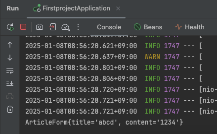
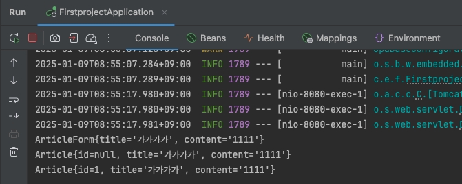

# 스프링 부트3 자바 백엔드 개발 입문 - 3일차

## 오늘의 학습 목차

- 3.1 폼 데이터란
- 3.2 폼 데이터를 DTO로 받기
- 3.3 DTO를 데이터베이스에 저장하기

## 3.1 폼 데이터란

폼 데이터란 HTML 요소인 `<form>` 태그에 실려 전송되는 데이터를 말한다. 폼에 실린 데이터는 서버의 컨트롤러가 객체에 담아 받게 되는데, 이 객체를 **DTO(Data Transfer Object)**라고 한다. DTO로 받은 데이터는 최종적으로 데이터베이스(DB)에 저장된다.

## 3.2 폼 데이터를 DTO로 받기

### 폼 데이터가 잘 전송되는지 확인하기 위해 form 태그를 포함한 mustache 파일을 만든다. (src > main > resources > templates > articles > new.mustache)

```html
{{>layouts/header}}

<form class="container" action="/articles/create" method="post">
  <div class="mb-3">
    <label class="form-label">제목</label>
    <input type="text" class="form-control" />
  </div>
  <div class="mb-3">
    <label class="form-label">내용</label>
    <textarea class="form-control" rows="3"></textarea>
  </div>
  <button type="submit" class="btn btn-primary">Submit</button>
</form>

{{>layouts/footer}}
```

위 파일에서 짚고 넘어가야 할 점은 다음과 같다.

- form 태그의 `action` 어트리뷰트는 폼 데이터를 어디에 전송할 지를 결정하는 요소이다. 즉, localhost:8080/articles/create로 폼 데이터를 보내게 된다.
- form 태그의 `method` 어트리뷰트는 어떻게 보낼 지 결정한다. 그 방법에는 GET, POST 두 가지가 있다.

### 이번에는 폼 데이터를 다룰 컨트롤러를 작성한다.

```java
package com.example.firstproject.controller;

import com.example.firstproject.dto.ArticleForm;
import org.springframework.stereotype.Controller;
import org.springframework.web.bind.annotation.GetMapping;
import org.springframework.web.bind.annotation.PostMapping;

@Controller
public class ArticleController {

    // (중략...)

    @PostMapping("/articles/create") // 뷰 페이지에서 post로 폼 데이터를 전송했으므로 @PostMapping 사용
    public String createArticle(ArticleForm form) {
        System.out.println(form.toString());
        return "";
    }
}
```

createArticle 메서드가 받는 ArticleForm 타입의 객체는 DTO(Data Transfer Object)로써, 서버가 받는 폼 데이터다. 폼 데이터를 받아 올 그릇을 마련하기 위해 DTO 클래스를 작성해야 한다.

```java
package com.example.firstproject.dto;

public class ArticleForm {
    // 필드 두 가지
    private String title;
    private String content;

    // 생성자(constructor)
    public ArticleForm(String title, String content) {
        this.title = title;
        this.content = content;
    }

    @Override // 메서드 오버라이드
    public String toString() {
        return "ArticleForm{" +
                "title='" + title + '\'' +
                ", content='" + content + '\'' +
                '}';
    }
}
```

이러고 나면, 컨트롤러가 폼 데이터를 받을 준비가 된 것 같지만 빠진 것이 있다.

### 입력 폼과 DTO 필드를 연결해야 한다.

```html
{{>layouts/header}}

<form class="container" action="/articles/create" method="post">
  <div class="mb-3">
    <label class="form-label">제목</label>
    <input type="text" class="form-control" name="title" />
  </div>
  <div class="mb-3">
    <label class="form-label">내용</label>
    <textarea class="form-control" rows="3" name="content"></textarea>
  </div>
  <button type="submit" class="btn btn-primary">Submit</button>
</form>

{{>layouts/footer}}
```

🚨**이전에 작성한 mustache 파일과 비교하여 변경된 점은 name 어트리뷰트를 사용한 것이다.**🚨 먼저 제목이 들어 갈 input 태그에 제목을 입력하고, 내용이 들어 갈 textarea 태그에 내용을 적고 난 뒤에 submit(제출)을 수행하는 버튼 클릭을 통해 폼 데이터를 /articles/create로 보낼 때 DTO인 ArticleForm의 두 필드(title, content)에 자동으로 연결되게 하려면 name이 필요하다...!

실제로 폼에서 제목과 내용을 입력한 뒤에 제출 버튼을 누르고 IntelliJ의 콘솔 창을 보면 다음과 같은 결과를 볼 수 있다.



## 3.3 DTO를 데이터베이스에 저장하기

데이터베이스(DB)란 쉽게 생각하면 데이터를 관리하는 창고다. DB 프로그램에는 MySQL, 오라클(Oracle), 마리아DB(MariaDB) 등 다양한 종류가 있다. 책에서는 **H2 DB**를 사용한다.

그런데, 단순하게 자바에게 데이터를 기록해달라고 하면 이해하지 못한다. 왜냐하면 스프링 부트는 자바라는 언어를 쓰지만, DB는 SQL(Structured Query Language)을 사용하기 때문이다.

DB에 자바로 명령을 내리려면 **JPA(Java Persistence API)**를 사용할 수 있다! JPA를 사용하면 좋은 점은, 데이터를 객체 지향적으로 관리할 수 있다는 점이다.

> [!IMPORTANT]
> JPA의 핵심 도구로는 엔티티(Entity)와 레포지토리(Repository)가 있다. 엔티티는 자바 객체를 DB가 이해할 수 있게 만든 것으로, 이를 기반으로 테이블이 만들어진다. 레포지토리는 엔티티가 DB 속 테이블에 저장 및 관리될 수 있게 하는 인터페이스다.

DTO를 데이터베이스가 이해할 수 있는 엔티티로 변환해보자. 여기서 유념해야 할 것은 DTO 클래스와 별개로 엔티티 클래스가 따로 필요한 것과 DTO인 ArticleForm을 엔티티로 변환하기 위해서 toEntity()라는 메서드가 필요하다는 점이다.

엔티티 클래스인 Aritcle을 만들어보자.

```java
package com.example.firstproject.entity;

import jakarta.persistence.Column;
import jakarta.persistence.Entity;
import jakarta.persistence.GeneratedValue;
import jakarta.persistence.Id;

@Entity // JPA에서 제공하는 어노테이션
public class Article {
    @Id
    @GeneratedValue
    private Long id;

    @Column
    private String title;

    @Column
    private String content;

    public Article() {
    }

    public Article(Long id, String title, String content) {
        this.id = id;
        this.title = title;
        this.content = content;
    }

    @Override
    public String toString() {
        return "Article{" +
                "id=" + id +
                ", title='" + title + '\'' +
                ", content='" + content + '\'' +
                '}';
    }
}
```

@Entity는 JPA에서 제공하는 어노테이션으로, 이 어노테이션을 기반으로 DB에 테이블이 생성된다. 또한, 테이블 이름은 엔티티 클래스와 동일하게 생성된다.

이외에 다른 어노테이션에 대한 설명은 다음과 같다.

- `@Column` : DB에서 인식할 수 있는 필드에 붙는 어노테이션
- `@Id` : 보통 Primary Key가 되는 Id에 붙는 어노테이션
- `@GeneratedValue` : 자동으로 값을 생성하는 특성을 갖도록 하는 어노테이션

이제 DTO인 AritcleForm 객체를 엔티티인 Article로 변환하는 toEntity() 메서드에 대한 구현이 필요하다.

AritcleForm.java로 가서 메서드를 작성하자.

```java
public class ArticleForm {
  // (생략)

  public Article toEntity() {
    return new Article(null, title, content); // null이라는 인자를 넘기는 이유는 @GeneratedValue이기 때문이다.
  }
}
```

이제는 레포지토리(ArticleRepository)로 엔티티를 DB에 저장(save)하는 코드를 작성할 수 있다.

```java
// (import문 생략)
@Controller
public class ArticleController {
    @Autowired
    private ArticleRepository articleRepository;

    @GetMapping("/articles/new")
    public String newArticleForm() {
        return "articles/new";
    }

    @PostMapping("/articles/create")
    public String createArticle(ArticleForm form) {
        System.out.println(form.toString());

        // 1. DTO를 엔티티로 변환
        Article article = form.toEntity();
        System.out.println(article.toString());
        // 2. 레포지토리로 엔티티를 DB에 저장
        Article saved = articleRepository.save(article);
        System.out.println(saved.toString());

        return "";
    }
}
```

컨트롤러에 있는 ArticleRepository를 객체를 선언한 적이 없다. 선언하자.

```java
package com.example.firstproject.repository;

import com.example.firstproject.entity.Article;
import org.springframework.data.repository.CrudRepository;

public interface ArticleRepository extends CrudRepository<Article, Long> {
}
```

여기서 ArticleRepository는 인터페이스고 CrudRepository 인터페이스를 상속받는다. CrudRepository는 JPA에서 제공하는 인터페이스로 이를 상속해서 엔티티를 관리(생성 - C, 조회 - R, 수정 - U, 삭제 - D)할 수 있다.

2개의 제네릭 요소인 Article(관리 대상의 엔티티 클래스 타입), Long(관리 대상 엔티티의 대푯값 타입)을 전달한다.

이렇게 선언한 것만으로도 CrudRepository가 제공하는 기능을 별도의 정의 없이 그대로 사용할 수 있다. 그러한 기능 중에 저장(save) 기능이 있는 것이다!

> [!IMPORTANT]
> 우리는 ArticleController에서 사용하는 ArticleRepository 타입의 인스턴스를 new 키워드로 만든 흔적이 없다. 그런데 어떻게 save 메서드를 사용할 수 있는 것일까❓ - 스프링 부트에서는 @Autowired 어노테이션을 붙이면 스프링 부트가 미리 생성해 놓은 객체를 가져다가 연결해주고, 이러한 개념을 의존성 주입(DI, Dependency Injection)이라고 한다.

이제 컨트롤러에 작성한 출력문이 잘 나오는지 확인하자. 확인해야 할 것은 다음과 같다.

1. post 요청과 함께 실려 온 폼 데이터(ArticleForm)
2. DB가 이해할 수 있는 형태인 엔티티로 변환된 데이터(Article)
3. 엔티티를 DB에 저장하고 나서의 데이터(Article)


