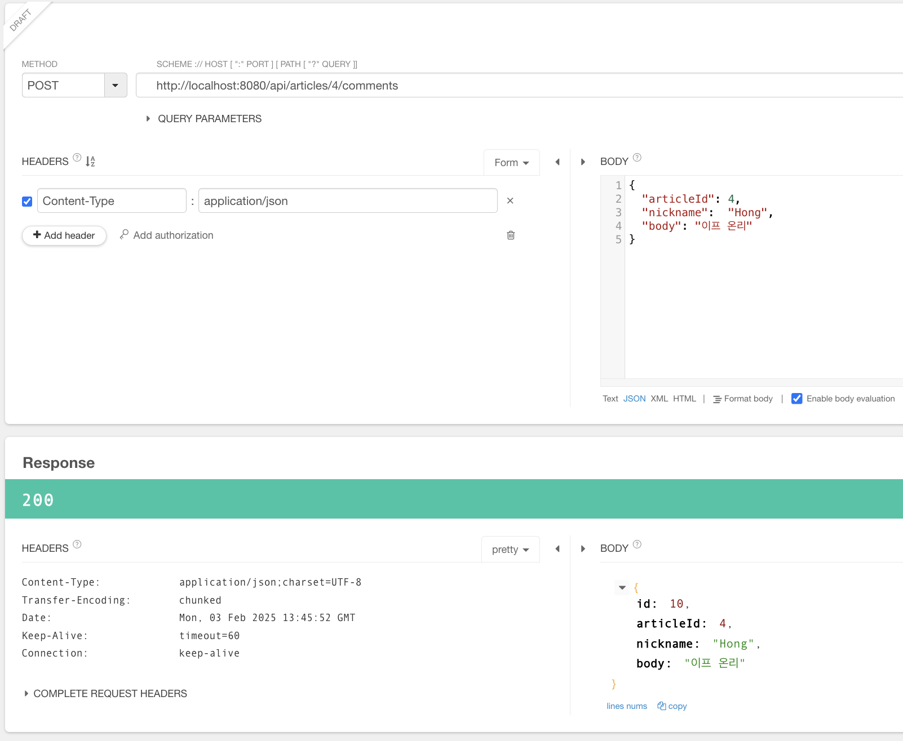
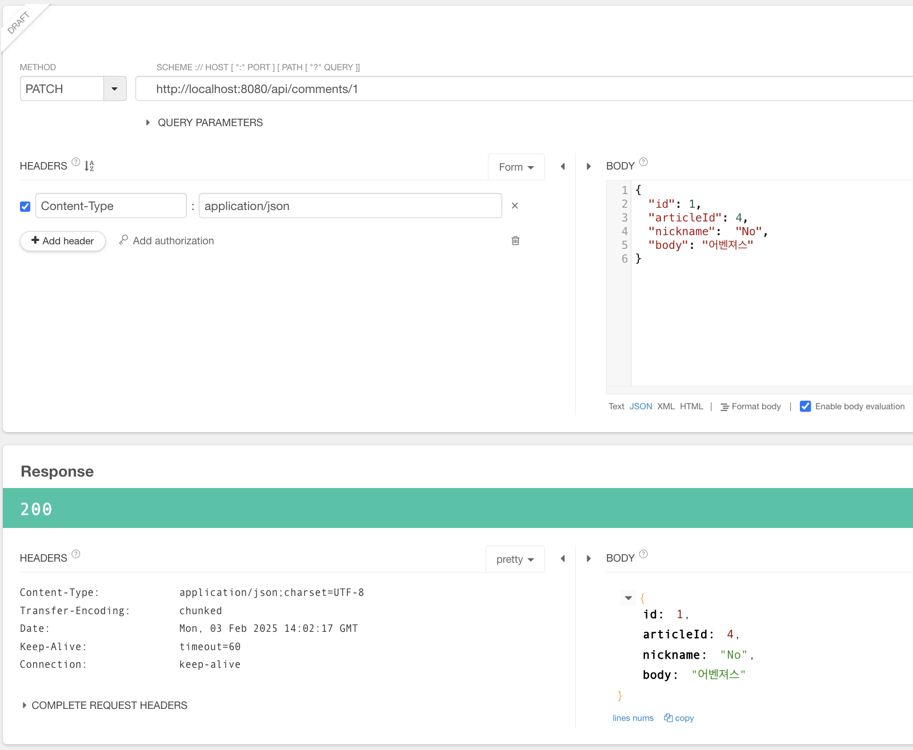
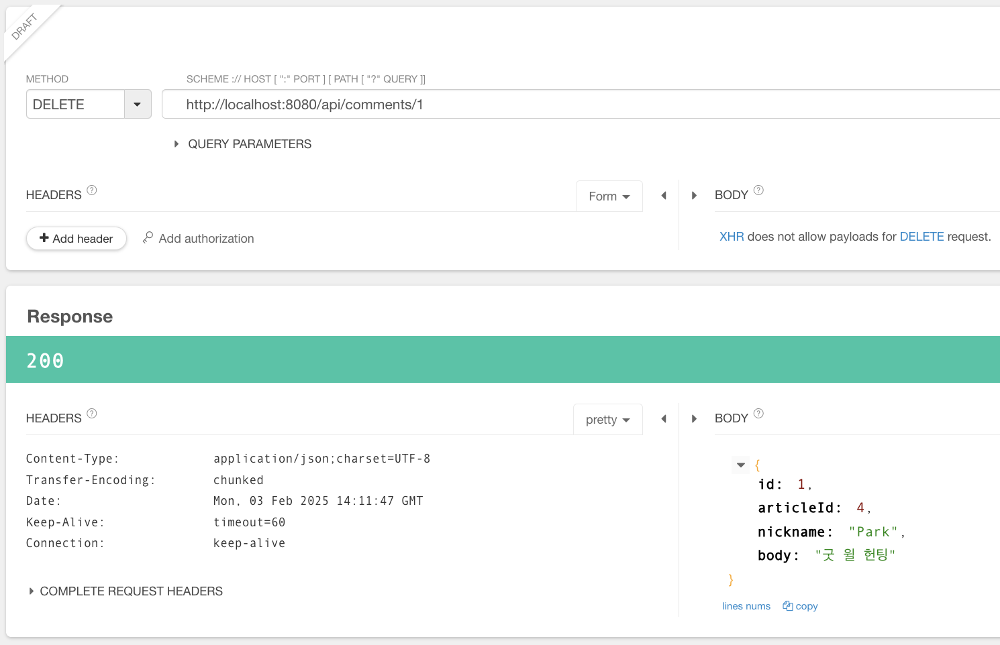

# 스프링 부트3 자바 백엔드 개발 입문 - 16일차

## 오늘의 학습 목차

- 15.4 댓글 생성하기
- 15.5 댓글 수정하기
- 15.6 댓글 삭제하기

## 15.4 댓글 생성하기

댓글을 생성하는 REST API 주소, `/articles/articleId/comments`로 요청을 보냈을 때 그에 대한 적절한 응답과 댓글이 생성되도록 만들어보자.

먼저 POST 요청을 받아줄 컨트롤러에 적절한 메서드를 작성해야 한다.

```java
// CommentApiController.java
@PostMapping("/api/articles/{articleId}/comments")
public ResponseEntity<CommentDto> create(@PathVariable Long articleId, @RequestBody CommentDto dto) {
    // 서비스에 위임
    CommentDto createdDto = commentService.create(articleId, dto);

    // 결과 응답
    // 실패한 경우의 예외 처리는 스프링 부트가 담당하므로 성공한다는 가정하에 코드 작성
    return ResponseEntity.status(HttpStatus.OK).body(createdDto);
}
```

댓글 조회때와 더불어, 컨트롤러는 서비스와 협업한다는 점과 클라이언트-서버 간에 dto 객체가 오간다는 점이다.

이번에는 컨트롤러와 협업하는 서비스에 비즈니스 로직을 작성하자.

```java
// CommentService.java
// 2. 댓글 생성
@Transactional
public CommentDto create(Long articleId, CommentDto dto) {
    // 1. 게시글 조회 및 예외 발생
    Article article = articleRepository.findById(articleId).orElseThrow(() -> new IllegalArgumentException("댓글 생성 실패! " + "대상 게시글이 없습니다."));

    // 2. 댓글 엔티티 생성
    Comment comment = Comment.createComment(dto, article);

    // 3. 댓글 엔티티를 DB에 저장
    Comment created = commentRepository.save(comment);

    // 4. DTO로 변환해 반환
    return CommentDto.createCommentDto(created);
}
```

서비스에 댓글 생성을 담당하는 메서드를 작성하면서 유의해야 할 점은 다음과 같다.

- `create()` 메서드는 DB 내용을 바꾸기 때문에 실패할 경우를 대비하여 `@Transactional`을 추가해야 한다.
- 신경써야 할 부분은 **생성 요청의 파라미터인 articleId에 해당하는 게시물이 없는 경우 댓글을 생성할 수 없다** 는 점이다.

위 코드에서 `Comment.createCommentDto()`라는 정적 메서드는 아직 만들지 않았으므로 Comment 클래스에 작성하도록 한다.

```java
// Comment.java
public static Comment createComment(CommentDto dto, Article article) {
    // 예외 발생
    if (dto.getId() != null) throw new IllegalArgumentException("댓글 생성 실패! 댓글의 id가 없어야 합니다.");
    if (dto.getArticleId() != article.getId()) throw new IllegalArgumentException("댓글 생성 실패! 게시글의 id가 잘못됐습니다.");

    // 엔티티 발생 및 반환
    return new Comment(
            dto.getId(),
            article,
            dto.getNickname(),
            dto.getBody()
    );
}
```

여기서도 신경써야 할 부분이 있다. 두 조건을 만족하지 않으면 예외를 발생시켜야 한다.⚠️

- 댓글 dto에 id가 있어서는 안된다.
- 댓글 dto와 연관된 게시물의 id가 실제 조회한 게시물과 일치해야 한다.

이제 Talend API를 활용해서 댓글 생성 요청을 보내보면 잘 생성된 것을 볼 수 있다.



## 15.5 댓글 수정하기

댓글을 수정하는 REST API 주소, `/comments/id`로 요청을 보냈을 때 그에 대한 적절한 응답과 댓글이 수정되도록 만들어보자.

해당 주소로 오는 요청을 받아줄 적절한 메서드를 컨트롤러에 작성해야 한다.

```java
// CommentApiController.java
@PatchMapping("/api/comments/{id}")
public ResponseEntity<CommentDto> update(@PathVariable Long id, @RequestBody CommentDto dto) {
    // 서비스에 위임
    CommentDto updatedDto = commentService.update(id, dto);

    // 결과 응답
    return ResponseEntity.status(HttpStatus.OK).body(updatedDto);
}
```

이번에는 요청을 처리할 서비스에 `update()` 메서드를 작성하자.

```java
// CommentService.java
// 3. 댓글 수정
@Transactional
public CommentDto update(Long id, CommentDto dto) {
    // 1. 댓글 조회 및 예외 발생
    Comment target = commentRepository.findById(id).orElseThrow(() -> new IllegalArgumentException("댓글 수정 실패! " + "대상 댓글이 없습니다."));

    // 2. 댓글 수정
    target.patch(dto);

    // 3. DB로 갱신
    Comment update = commentRepository.save(target);

    // 4. 댓글 엔티티를 DTO로 변환 및 반환
    return CommentDto.createCommentDto(update);
}
```

이번에도 신경써야 할 부분이 있다면,

- `update()` 메서드는 DB 내용을 바꾸기 때문에 실패할 경우를 대비하여 `@Transactional`을 추가해야 한다.
- 신경써야 할 부분은 **요청과 함께 온 dto에 특정 속성에 대한 변경이 없을 때 null로 수정되지 않도록 주의해야 한다** 는 점이다.

그래서 Comment 클래스에서 patch 메서드를 작성해야 한다.

```java
// Comment.java
public void patch(CommentDto dto) {
    // 예외 발생
    if (this.id != dto.getId()) throw new IllegalArgumentException("댓글 수정 실패! 잘못된 id가 입력됐습니다.");

    // 객체 갱신
    if (dto.getNickname() != null) this.nickname = dto.getNickname();
    if (dto.getBody() != null) this.body = dto.getBody();
}
```

이제 잘 수정되는지 확인해보자.



## 15.6 댓글 삭제하기

`/comments/id` URL로 삭제 요청이 왔을 때, 이를 응답해 줄 컨트롤러를 만들자.

```java
// CommentApiController.java
@DeleteMapping("/api/comments/{id}")
public ResponseEntity<CommentDto> delete(@PathVariable Long id) {
    // 서비스에 위임
    CommentDto deletedDto = commentService.delete(id);

    // 결과 응답
    return ResponseEntity.status(HttpStatus.OK).body(deletedDto);
}
```

> [!NOTE]
> 굳이 삭제 요청으로 인해 삭제된 데이터를 응답받을 필요가 있을까❓ - 보안이 매우 중요한 환경이나 로그를 남겨야 할 필요가 있는 서비스에서 어떤 데이터가 삭제되었는지 확인하는 작업이 유용할 수 있다...!

이번에는 `delete()` 메서드를 서비스 계층에 만들자.

```java
// CommentService.java
 // 4. 댓글 삭제
public CommentDto delete(Long id) {
    // 1. 댓글 조회 및 예외 발생
    Comment target = commentRepository.findById(id).orElseThrow(() -> new IllegalArgumentException("댓글 삭제 실패! " + "대상 댓글이 없습니다."));

    // 2. 댓글 삭제
    commentRepository.delete(target);

    // 3. 삭제 댓글을 DTO로 변환 및 반환
    return CommentDto.createCommentDto(target);
}
```

서버를 재시작하고 Talend API에서 삭제가 잘 되는지, 삭제된 데이터가 잘 응답되는지 확인할 수 있다.


