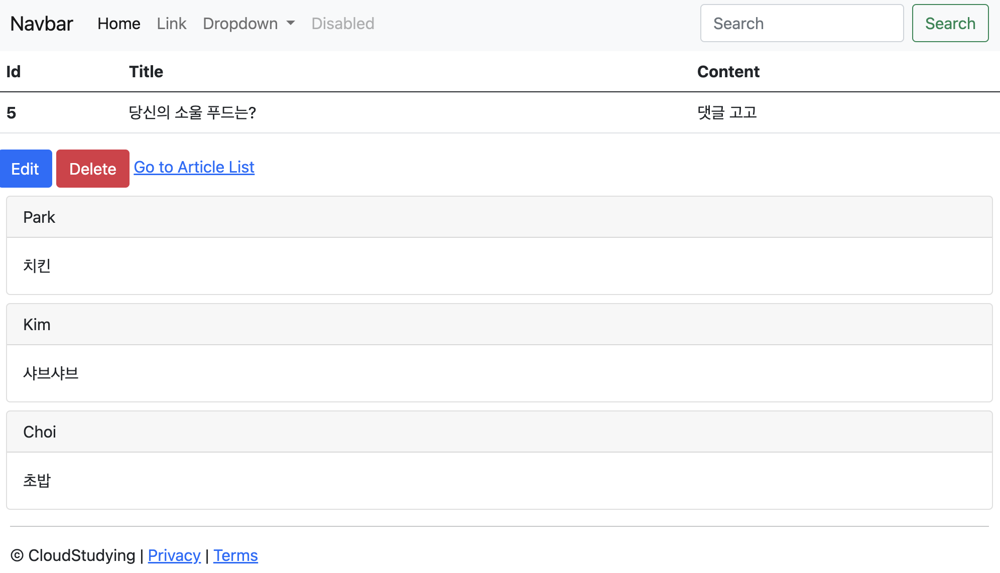

# 스프링 부트3 자바 백엔드 개발 입문 - 17일차

## 오늘의 학습 목차

- 16.1 댓글 보기의 개요
- 16.2 댓글 뷰 페이지 삽입하기
- 16.3 댓글 목록 가져오기

## 16.1 댓글 보기의 개요

댓글 CRUD 기능을 모두 만들었으니 서버에서 처리한 댓글을 사용자가 볼 수 있도록 뷰 페이지를 만들고 출력해보자.

보통 게시판의 특정 글을 클릭하면 상세 페이지(show)가 뜨면서 그 아래에 댓글이 보인다.

그리고 기존 댓글 리스트를 보여주는 영역과 새 댓글을 입력하는 영역이 있다.

## 16.2 댓글 뷰 페이지 삽입하기

프로젝트 탐색기의 controller 패키지 > ArticleController 클래스를 보면 `show()` 메서드가 `/articles/{id}`로 접속했을 때 보여주는 페이지인 `show.mustache`를 반환하고 있다.

이제 이 `show.mustache`에 댓글 리스트와 새 댓글을 입력하는 영역을 추가하면 된다.

```html
<!-- templates/articles/show.mustache -->
<!-- 일부 생략 -->

{{>comments/_comments}} {{>layouts/footer}}
```

이제 `_comments.mustache`라는 댓글 영역 부분을 한 파일로 빼내어 작성하자.

```html
<!-- templates/comments/_comments.mustache -->
<div>
  <!-- 댓글 목록 보기 -->
  {{>comments/_list}}
</div>
```

또 댓글 영역 부분을 두 영역(댓글 리스트 영역 + 댓글 입력 영역)으로 나눌 수 있다고 했으므로 `_list.mustache`와 `_new.mustache` 파일을 각각 만들자. 먼저 `_list.mustache`만 만든다.

```html
<!-- templates/comments/_list.mustache -->
<div id="comments-list">
  {{#commentDtos}}
  <div class="card m" id="comments-{{id}}">
    <div class="card-header">{{nickname}}</div>
    <div class="card-body">{{body}}</div>
  </div>
  {{/commentDtos}}
</div>
```

{{#commentDtos}}...{{/commentDtos}} 부분은 commentDtos가 여러 데이터라면 콧수염 문법 안쪽에 있는 내용을 반복하라는 뜻이다.

그런데, 다시 서버를 재시작하고 `http://localhost:8080/articles/5`에 접속해도 댓글 리스트는 볼 수 없다. 왜냐하면, 뷰 페이지에서 사용하는 commentDtos를 모델에 등록하지 않았기 때문이다.

## 16.3 댓글 목록 가져오기

ArticleController의 show() 메서드에서 1. commentDtos를 가져오도록 CommentService에 위임하고, 2. 모델에 등록하는 과정이 필요하다.

```java
// ArticleController.java
@GetMapping("/articles/{id}")
public String show(@PathVariable Long id, Model model) {
    // 1. id를 조회해 데이터 가져오기
    Article articleEntity = articleRepository.findById(id).orElse(null);
    List<CommentDto> commentDtos = commentService.comments(id);

    // 2. 모델에 데이터 등록하기
    model.addAttribute("article", articleEntity);
    model.addAttribute("commentDtos", commentDtos);

    // 3. 뷰 페이지 반환하기
    return "articles/show";
}
```

CommentService 객체를 주입받아야 하므로 ArticleController 클래스 내부에 다음 코드도 필요하다.

```java
// ArticleController.java
@Slf4j
@Controller
public class ArticleController {
    @Autowired
    private ArticleRepository articleRepository;

    @Autowired
    private CommentService commentService;

    // ... 생략
}
```

이제 서버를 재시작하고 `http://localhost:8080/articles/5`에 접속하면 다음과 같은 댓글 리스트 영역을 볼 수 있다.


