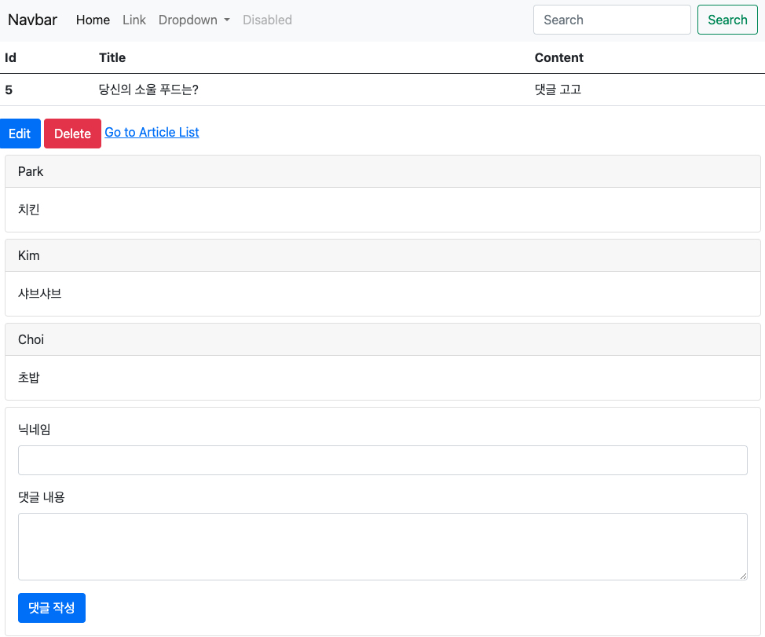
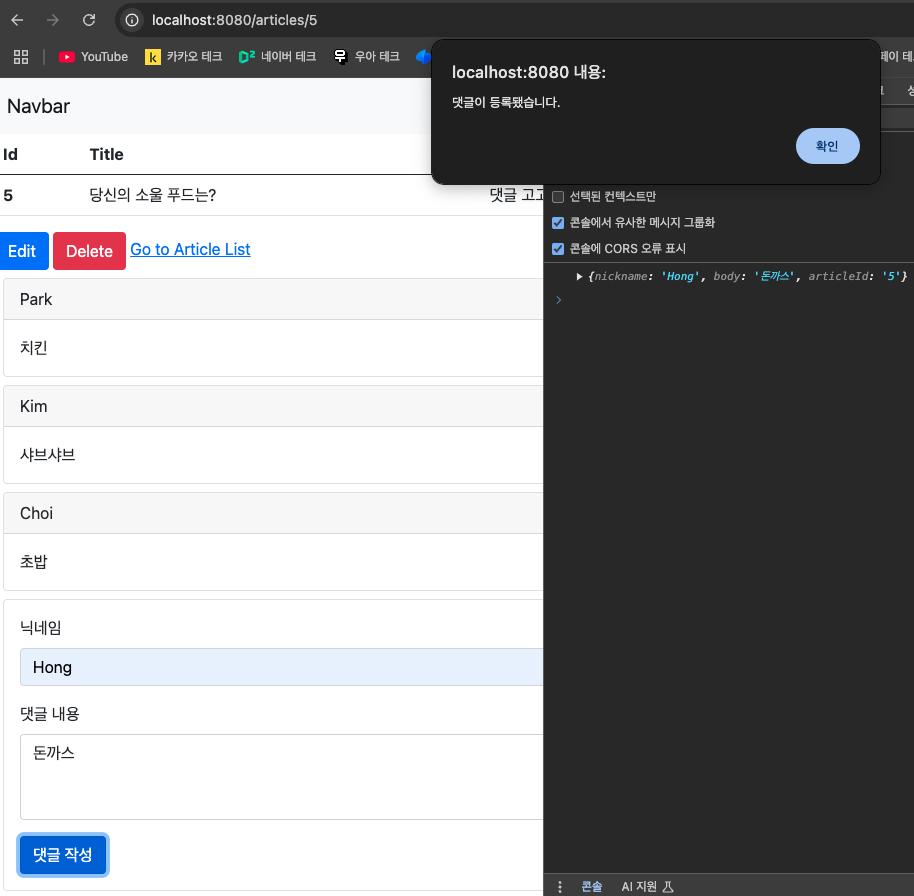
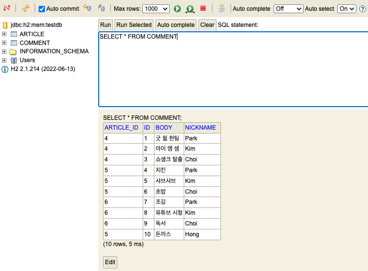

# 스프링 부트3 자바 백엔드 개발 입문 - 18일차

## 오늘의 학습 목차

- 17.1 댓글 등록의 개요
- 17.2 댓글 생성 뷰 페이지 만들기
- 17.3 자바스크립트로 댓글 달기

## 17.1 댓글 등록의 개요

16장에서 댓글 리스트를 받는 영역은 완성했지만, 아직 새 댓글을 등록하는 부분은 아직 구현하지 못했다.

`_comments.mustache`에 `_new.mustache`를 추가하는 것부터 시작하자.

## 17.2 생성 뷰 페이지 만들기

```html
<!-- comments/_comments.mustache -->
<div>
  <!-- 댓글 목록 보기 -->
  {{>comments/_list}}
  <!-- 새 댓글 작성하기 -->
  {{>comments/_new}}
</div>
```

```html
<!-- comments/_new.mustache -->
<div class="card m-2" id="comments-new">
  <div class="card-body">
    <!-- 댓글 작성 폼 -->
    <form>
      <!-- 닉네임 입력 -->
      <div class="mb-3">
        <label class="form-label">닉네임</label>
        <input type="text" class="form-control" id="new-comment-nickname" />
      </div>
      <!-- 댓글 본문 입력 -->
      <div class="mb-3">
        <label class="form-label">댓글 내용</label>
        <textarea
          type="text"
          class="form-control"
          rows="3"
          id="new-comment-body"
        ></textarea>
      </div>
      {{#article}}
      <input type="hidden" id="new-comment-article-id" value="{{id}}" />
      {{/article}}
      <!-- 전송 버튼 -->
      <button type="submit" class="btn btn-primary" id="comment-create-btn">
        댓글 작성
      </button>
    </form>
  </div>
</div>
```

아래 사진처럼 댓글 등록하는 부분이 부트스트랩의 도움을 받아 스타일이 적용된 상태로 잘 나온다.



## 17.3 자바스크립트로 댓글 달기

이전까지는 CRUD 기능이 잘 동작하는지 Talend API 서비스를 사용해서 검증했다면, **이번에는 실제 웹 어플리케이션처럼 댓글을 작성하고 제출 버튼을 누르면 자바스크립트로 REST API를 호출하고 잘 동작** 하는지 확인해보자.

`_new.mustache` 파일의 하단에 script 태그를 추가하여 자바스크립트로 호출하는 것부터 시작한다.

댓글을 생성 요청을 받고 응답하는 컨트롤러의 메서드에서 요구하는 파라미터는 CommentDto 타입으로 닉네임, 본문, 부모 게시글의 id를 객체로 만들어 보내야 한다.

```html
<!-- comments/_new.mustache -->
<!-- 일부 생략 -->
</div>
<script>
    // 댓글 생성 버튼 변수화
    const commentCreateBtn = document.querySelector("#comment-create-btn");
    // 댓글 클릭 이벤트 감지
    commentCreateBtn.addEventListener("click", function () {
        // 교재에서는 console.log()를 사용하여 실제로 리스너가 잘 동작하는지 확인하지만 생략한다.
        // 새 댓글 객체 생성
        const comment = {
            // 새 댓글의 닉네임
            nickname: document.querySelector("#new-comment-nickname").value,
            // 새 댓글의 본문
            body: document.querySelector("#new-comment-body").value,
            // 부모 게시글의 id
            articleId: document.querySelector("#new-comment-article-id").value
        };
        // 댓글 객체 출력
        console.log(comment);
    });
</script>
```

> [!NOTE]
> DOM을 조작하기 위해 document라는 객체를 사용할 수 있고, `querySelector()`라는 메서드를 활용해서 DOM에 있는 특정 id나 class 값을 가진 요소를 찾아 변수에 할당할 수 있다. 그리고, 해당 요소에 `addEventListener()`를 통해 특정 이벤트를 감지하게끔 이벤트 리스너를 등록할 수 있다.

> [!WARNING]
> form 태그 내 submit 타입인 버튼을 누르게 되면 서버로 요청과 동시에 페이지가 새로고침되므로, 객체 출력을 위한 `console.log()` 메서드로 콘솔에서 객체를 확인하고 싶으면 form 태그를 주석 처리해야 한다.

### 17.3.3 자바스크립트로 REST API 호출하고 응답 처리하기

자바스크립트에서는 표준인 fetch() API를 사용해서 비통기 통신을 처리할 수 있다.

`fetch()`에 들어가는 파라미터에 대한 설명은 다음과 같다.

1. url(REST API 주소)
2. 요청 메서드(method), 헤더 정보(headers), 전송 본문(body)를 담은 객체

스크립트 태그 안에 `fetch()`를 추가하면,

```html
<!-- 일부 생략 -->
</div>
<script>
    // 댓글 생성 버튼 변수화
    const commentCreateBtn = document.querySelector("#comment-create-btn");
    // 댓글 클릭 이벤트 감지
    commentCreateBtn.addEventListener("click", function () {
        // 교재에서는 console.log()를 사용하여 실제로 리스너가 잘 동작하는지 확인하지만 생략한다.
        // 새 댓글 객체 생성
        const comment = {
            // 새 댓글의 닉네임
            nickname: document.querySelector("#new-comment-nickname").value,
            // 새 댓글의 본문
            body: document.querySelector("#new-comment-body").value,
            // 부모 게시글의 id
            articleId: document.querySelector("#new-comment-article-id").value
        };
        // 댓글 객체 출력
        console.log(comment);
        // fetch() - 비동기 통신을 위한 API
        const url = '/api/articles/' + comment.articleId + "/comments";
        fetch(url, {
            method: "POST", // POST 요청
            headers: { // 전송 본문의 데이터 타입(JSON) 정보
                "Content-Type": "application/json"
            },
            body: JSON.stringify(comment) // comment 객체를 JSON 문자열로 변환해 전송
        }).then(response => {
            // HTTP 응답 코드에 따른 메시지 출력
            const msg = (response.ok) ? "댓글이 등록됐습니다." : "댓글 등록 실패..!";
            alert(msg);
            // 현재 페이지 새로 고침
            window.location.reload();
        })
    });
</script>
```

이제 제출 버튼을 누르면 내가 작성한 댓글 정보를 변수화, 그리고 객체화한 뒤에 원하는 url로 POST 요청을 보내서 댓글을 생성할 수 있다.

클라이언트 입장에서는 댓글 생성이 잘 되었는지 피드백받아야 할 필요가 있으므로 Promise 객체의 후속 처리 메서드인 then을 활용했다. 응답이 200번대를 나타내는 `response.ok`인지 아닌지에 따라 다른 메시지를 window 전역 객체가 제공하는 `alert()` API를 통해 화면에 띄우도록 한다.

서버 재시작 후, 댓글을 작성해서 제출하면 다음과 같은 화면을 볼 수 있다. 그리고 h2-console에도 댓글이 잘 생성된 것을 볼 수 있다.





> [!NOTE]
> window.alert()는 코드의 흐름을 blocking하는 효과가 있어서 alert 창의 확인 버튼을 눌러야지만 현재 페이지 새로 고침을 촉발하는 `window.location.reload();` 코드가 실행된다. 웬만하면 alert() API는 쓰지 않는 것이 좋다.
