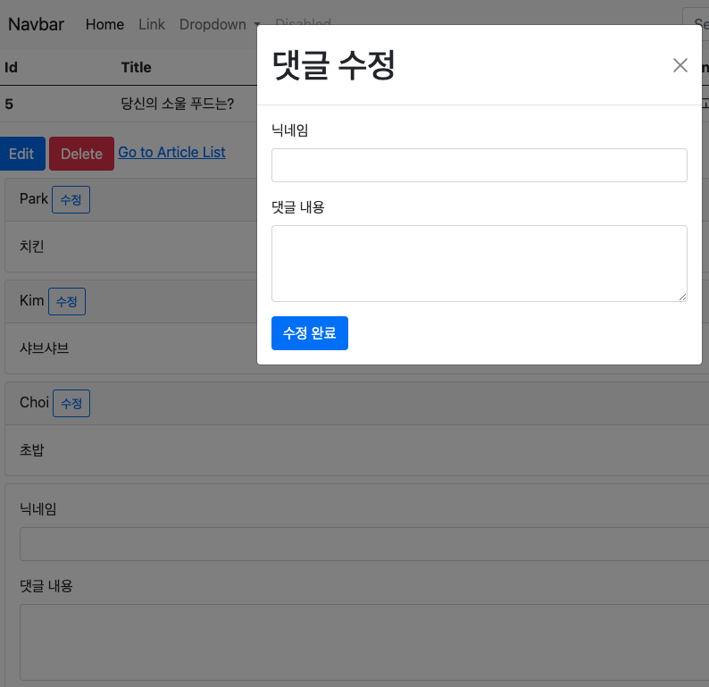
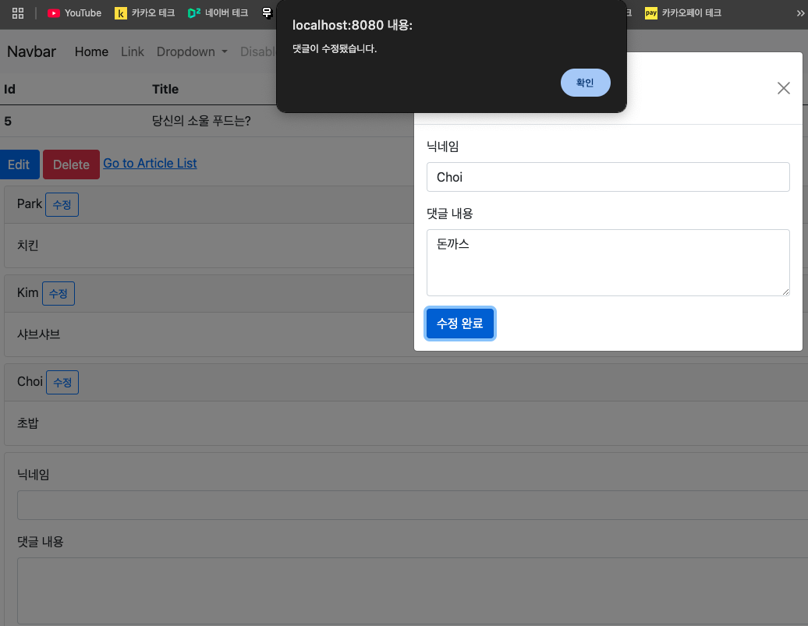
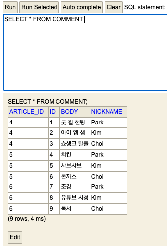

# 스프링 부트3 자바 백엔드 개발 입문 - 19일차

## 오늘의 학습 목차

- 18.1 댓글 수정의 개요
- 18.2 댓글 수정 뷰 페이지 만들기
- 18.3 자바스크립트로 댓글 수정하기

## 18.1 댓글 수정의 개요

17장에서 댓글 생성 뷰 페이지를 만들고 자바스크립트로 댓글 생성 요청을 했다면, 이번 장에서는 댓글 수정 뷰 페이지를 만들고 자바스크립트의 이벤트 핸들링을 통해 **댓글 수정** 을 해보자.

댓글 수정은 새로운 페이지에서 하지 않고 웹 페이지 내부에서 상위 레이어를 띄는 방식인 모달(modal)을 이용하려고 한다.

## 18.2 댓글 수정 뷰 페이지 만들기

부트스트랩에서 제공하는 모달을 트리거하는 버튼을 `_list.mustache` 파일에 갖다 붙이자.

그리고, 실제 모달 UI를 담당하는 코드를 아래 갖다 붙인 후에, 적절한 id 값을 부여하는 것이 중요하다.

또한 모달 창에는 댓글 수정을 위한 form 요소가 필요하므로 `_new.mustache`에서 가져다 붙여넣기 할 수 있다.

```html
<!-- _list.mustache -->
<div id="comments-list">
  {{#commentDtos}}
  <div class="card m-2" id="comments-{{id}}">
    <div class="card-header">
      {{nickname}}
      <!-- Button trigger modal -->
      <button
        type="button"
        class="btn btn-sm btn-outline-primary"
        data-bs-toggle="modal"
        data-bs-target="#comment-edit-modal"
      >
        수정
      </button>
    </div>
    <div class="card-body">{{body}}</div>
  </div>
  {{/commentDtos}}
</div>
<!-- Modal -->
<div
  class="modal fade"
  id="comment-edit-modal"
  tabindex="-1"
  aria-labelledby="exampleModalLabel"
  aria-hidden="true"
>
  <div class="modal-dialog">
    <div class="modal-content">
      <div class="modal-header">
        <h1 class="modal-title" id="exampleModalLabel">댓글 수정</h1>
        <button
          type="button"
          class="btn-close"
          data-bs-dismiss="modal"
          aria-label="Close"
        ></button>
      </div>
      <div class="modal-body">
        <!-- 댓글 수정 폼 -->
        <form>
          <!-- 닉네임 입력 -->
          <div class="mb-3">
            <label class="form-label">닉네임</label>
            <input
              type="text"
              class="form-control"
              id="edit-comment-nickname"
            />
          </div>
          <!-- 댓글 본문 입력 -->
          <div class="mb-3">
            <label class="form-label">댓글 내용</label>
            <textarea
              type="text"
              class="form-control"
              rows="3"
              id="edit-comment-body"
            ></textarea>
          </div>
          {{#article}}
          <input type="hidden" id="edit-comment-id" />
          <input type="hidden" id="edit-comment-article-id" value="{{id}}" />
          {{/article}}
          <!-- 전송 버튼 -->
          <button class="btn btn-primary" id="comment-update-btn">
            수정 완료
          </button>
        </form>
      </div>
    </div>
  </div>
</div>
```

이제 서버를 시작해서 `localhost:8080/articles/5`로 접속해서 댓글 수정 버튼을 누르면 다음과 같은 모달 UI를 볼 수 있다.



## 18.3 자바스크립트로 댓글 수정하기

댓글을 수정하기 위해서 이전 댓글 데이터를 가져와야 한다. 댓글 수정 버튼을 눌러서 모달 UI에 들어 있는 수정 폼이 이전 데이터를 갖고 있도록 만들자.

`data-`로 시작하는 속성을 **데이터 속성** 이라고 하는데 HTML 요소에 추가 정보를 저장하고 싶을 때 사용한다.

모달을 트리거하는 버튼에 데이터 속성을 추가하면 모달에 데이터를 넘길 수 있다.

```html
<!-- Button trigger modal -->
<button
  type="button"
  class="btn btn-sm btn-outline-primary"
  data-bs-toggle="modal"
  data-bs-target="#comment-edit-modal"
  data-bs-id="{{id}}"
  data-bs-nickname="{{nickname}}"
  data-bs-body="{{body}}"
  data-bs-article-id="{{articleId}}"
>
  수정
</button>
```

이제 받아 온 데이터를 모달의 폼에 출력해야 한다.

그러기 위해서 자바스크립트로 제어하는 코드가 필요한데, 이 때 흐름은 다음과 같다.

1. 특정 모달 요소를 id로 선택해서 변수화하기
2. 특정 모달이 보여지는 이벤트가 발생했을 때, 트리거 버튼을 선택하고 그 트리거 버튼에 매핑된 데이터를 가져오기
3. 수정 폼에 데이터 반영하기

```html
<!-- _list.mustache -->
<!-- 스크립트 태그만 작성 -->
<!-- 모달 이벤트 처리 -->
<script>
  // 모달 요소 선택
  const commentEditModal = document.querySelector("#comment-edit-modal");
  // 모달 이벤트 감지
  commentEditModal.addEventListener("show.bs.modal", function (event) {
    // show.bs.modal은 모달이 표시되기 직전 실행되는 이벤트다.
    // 1. 트리거 버튼 선택
    const triggerBtn = event.relatedTarget;
    // 2. 데이터 가져오기
    const id = triggerBtn.getAttribute("data-bs-id");
    const nickname = triggerBtn.getAttribute("data-bs-nickname");
    const body = triggerBtn.getAttribute("data-bs-body");
    const articleId = triggerBtn.getAttribute("data-bs-article-id");
    // 3. 수정 폼에 데이터 반영
    document.querySelector("#edit-comment-nickname").value = nickname;
    document.querySelector("#edit-comment-body").value = body;
    document.querySelector("#edit-comment-id").value = id;
    document.querySelector("#edit-comment-article-id").value = articleId;
  });
</script>
```

### 18.3.2 자바스크립트로 REST API 호출하고 응답 처리하기

이제 수정 완료 버튼의 클릭 이벤트를 감지하고, 댓글 수정 요청을 서버로 보내는 작업을 하자.

```javascript
// 수정 완료 버튼 선택
const commentUpdateBtn = document.querySelector("#comment-update-btn");
commentUpdateBtn.addEventListener("click", function () {
  const comment = {
    id: document.querySelector("#edit-comment-id").value,
    nickname: document.querySelector("#edit-comment-nickname").value,
    body: document.querySelector("#edit-comment-body").value,
    article_id: document.querySelector("#edit-comment-article-id").value,
  };
  console.log(comment);
  // 수정 REST API 호출
  const url = "/api/comments/" + comment.id;
  fetch(url, {
    method: "PATCH",
    headers: {
      "Content-Type": "application/json",
    },
    body: JSON.stringify(comment),
  }).then((response) => {
    const msg = response.ok ? "댓글이 수정됐습니다." : "댓글 수정 실패..!";
    alert(msg);
    window.location.reload();
  });
});
```

이전에 댓글 생성할 때 fetch() API를 사용했을 떄와 비슷한데, 다른 점은 요청 메서드와 보내는 데이터에 id 필드가 추가된 것 뿐이다.

서버를 재시작하고 닉네임이 'Choi'인 데이터의 내용(body)을 '초밥'에서 '돈까스'으로 바꿔보자.



h2-console에서도 바뀐 것을 볼 수 있다.


