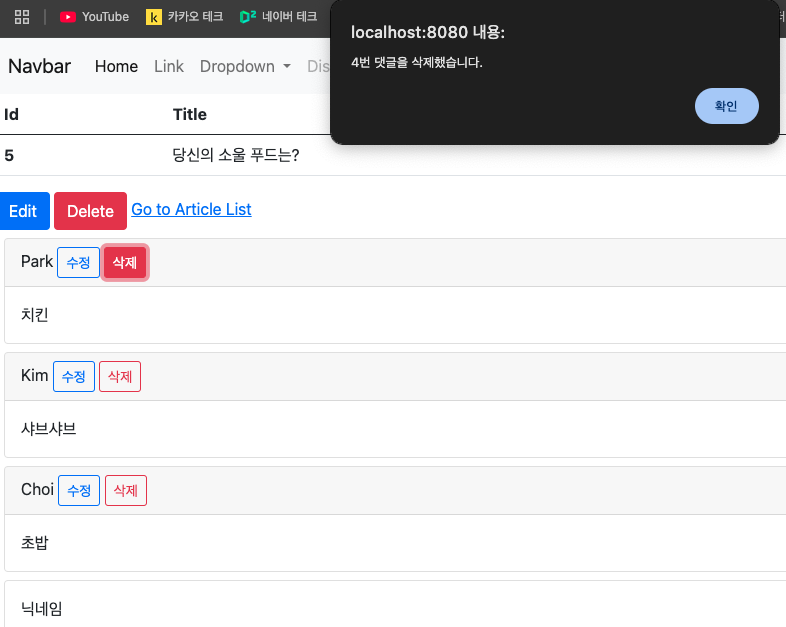
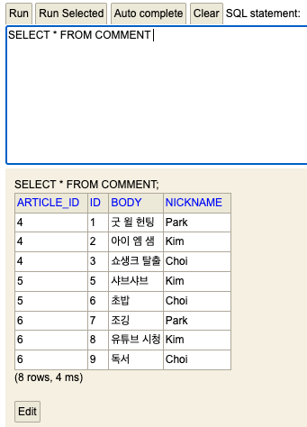

# 스프링 부트3 자바 백엔드 개발 입문 - 20일차

## 오늘의 학습 목차

- 19.1 댓글 삭제의 개요
- 19.2 댓글 삭제 버튼 추가하기
- 19.3 자바스크립트로 댓글 삭제하기
- 19.4 책을 마무리하며

## 19.1 댓글 삭제의 개요

지금까지 댓글 조회, 생성, 수정 기능을 구현했고 이제 삭제 기능을 구현하려고 한다.

주의해야 할 점은 삭제 버튼을 클릭했을 때, 삭제 버튼을 통해 댓글의 id를 전달해야 어떤 댓글을 삭제할 지 알 수 있다는 점이다.

## 19.2 댓글 삭제 버튼 추가하기

`_list.mustache`의 모달을 트리거하는 수정 버튼 아래 삭제 버튼을 추가한다.

```html
<!-- _list.mustache -->
<!-- Button trigger modal -->
<button
  type="button"
  class="btn btn-sm btn-outline-primary"
  data-bs-toggle="modal"
  data-bs-target="#comment-edit-modal"
  data-bs-id="{{id}}"
  data-bs-nickname="{{nickname}}"
  data-bs-body="{{body}}"
  data-bs-article-id="{{articleId}}"
>
  수정
</button>
<!-- 댓글 삭제 버튼 -->
<button type="button" class="btn btn-sm btn-outline-danger comment-delete-btn">
  삭제
</button>
```

## 19.3 자바스크립트로 댓글 삭제하기

`_list.mustache` 파일 하단에 댓글 삭제를 위한 script 태그를 작성하자.

```javascript
{
  // 삭제 버튼 선택
  const commentDeleteBtns = document.querySelectorAll(".comment-delete-btn");
  // 삭제 버튼 이벤트 처리
  commentDeleteBtns.forEach((btn) => {
    btn.addEventListener("click", (event) => {
      // 이벤트 발생 요소 선택
      const commentDeleteBtn = event.target;
      // 삭제 댓글 id 가져오기
      const commentId = commentDeleteBtn.getAttribute("data-comment-id");
      // 삭제 REST APi 호출
      const url = `/api/comments/${commentId}`;
      fetch(url, {
        method: "DELETE",
      }).then((response) => {
        if (!response.ok) {
          alert("댓글 삭제 실패..!");
          return;
        }

        const msg = `${commentId}번 댓글을 삭제했습니다.`;
        alert(msg);
        window.location.reload();
      });
    });
  });
}
```

그리고 댓글의 id를 넘기기 위한 삭제 버튼을 수정한다.

```html
<!-- 댓글 삭제 버튼 -->
<button
  type="button"
  class="btn btn-sm btn-outline-danger comment-delete-btn"
  data-comment-id="{{id}}"
>
  삭제
</button>
```

위 코드에서 알아챌 수 있는 내용은 다음과 같다.

- 다수의 댓글은 하나의 id를 가질 수 없으므로 클래스에 **comment-delete-btn** 을 명시한다.
- 만약 `querySelector()`로 요소를 변수화하면, comment-delete-btn을 갖는 모든 요소 중 하나만 가져오게 되므로 querySelectorAll()을 사용해야 한다.
- 가져 온 여러 개의 요소를 순회하기 위해 forEach()라는 Array.prototype이 제공하는 고차함수를 사용할 수 있다.

이제 서버를 실행하고 4번 댓글을 삭제해보자.



그리고 h2-console에서도 4번 id를 가진 댓글이 사라진 것을 확인할 수 있다.



## 19.4 책을 마무리하며

- H2 DB는 데이터를 디스크가 아닌 메모리에 저장하는 인메모리 데이터베이스라서 서버를 재시작해도 작업한 데이터를 유지하려면 외부 DB(PostgreSQL, MySQL, 오라클 등)를 연동해야 한다.
- 회원 관리와 소셜 로그인 기능을 공부하고 싶다면 스프링 시큐리티 학습이 필요하다.
- 데이터 관리와 설계를 공부하고 싶다면 스프링 JPA와 SQL 학습이 필요하다.
- 클라이언트를 위한 프론트엔드는 자바스크립트를 공부해야 한다.
- 인터넷에 서비스 배포는 리눅스와 AWS를 공부하면 된다.
